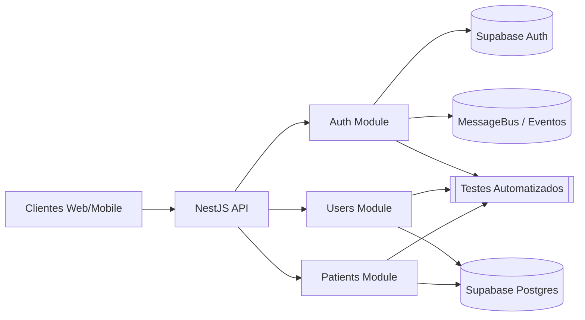

# OnTerapi 

Plataforma SaaS multi-tenant para gestao de clinicas e terapeutas, com Supabase Auth, 2FA, RBAC e modulo de pacientes conectado diretamente ao storage do Supabase.

## Sumario
- [Visao Geral](#visao-geral)
- [Credenciais de Teste](#credenciais-de-teste)
- [Fluxo de Autenticacao](#fluxo-de-autenticacao)
- [Modulo de Pacientes](#modulo-de-pacientes)
- [Modulo de Usuarios](#modulo-de-usuarios)
- [Exportacao de Pacientes](#exportacao-de-pacientes)
- [Documentacao Swagger](#documentacao-swagger)
- [Como Rodar Localmente](#como-rodar-localmente)
- [Testes Manuais Recomendados](#testes-manuais-recomendados)
- [Guia para Novos Modulos](#guia-para-novos-modulos)
- [Matriz de Testes Automatizados](#matriz-de-testes-automatizados)
- [Fluxo Completo de Teste via cURL](#fluxo-completo-de-teste-via-curl)
- [Troubleshooting](#troubleshooting)
- [Linha de Base de Qualidade](#linha-de-base-de-qualidade)
- [Fluxograma do Projeto](#fluxograma-do-projeto)

## Visao Geral
- NestJS 10 + TypeScript 5 + Result Pattern
- Supabase Cloud (PostgreSQL + Auth) como camada de dados principal
- TypeORM apenas para entidades/seed de apoio (sem banco local)
- JWT proprio (access/refresh) + 2FA por email
- MessageBus + eventos de dominio para auditar autenticao e pacientes
- DRY/Clean Architecture com BaseUseCase, BaseGuard e MessageBus unificados

## Credenciais de Teste
Não mantemos mais credenciais padrão em repositório. Gere usuários administrativos manualmente via `/users` e armazene os acessos em um cofre seguro.

> Para fluxos locais, utilize os dados de ambiente em `./.env` e gere o 2FA pelo endpoint `/auth/two-factor/send` quando necessário.

## Fluxo de Autenticacao
1. `POST /auth/sign-in` com email/senha. Super admin exige 2FA automaticamente.
2. `POST /auth/two-factor/send` com `tempToken` recebido.
3. Buscar codigo 2FA em `two_factor_codes` (via Supabase REST) ou pelo painel Resend ou caixa de entrada configurada.
4. `POST /auth/two-factor/validate` com `tempToken` + `code`.
5. A partir do access token:
   - `GET /auth/me`
   - `POST /auth/refresh` com refresh token
   - `POST /auth/sign-out` (opcionalmente `{ "allDevices": true }`) agora cancela tambem as sessoes Supabase quando possivel e ignora tokens invalidos sem log de erro.

### Logs e Auditoria
- Todos os eventos (sign-in, 2FA enviado/validado, logout) sao publicados via `MessageBus`.
- Guardas `JwtAuthGuard`, `RolesGuard` e `TenantGuard` foram revisados para usar o contexto completo do usuario.

## Modulo de Pacientes
- CRUD completo persistido na tabela `patients` do Supabase.
- Filtros suportados: `status`, `riskLevel`, `tags`, `query`, paginacao e ordenacao (`createdAt`, `updatedAt`, `fullName`).
- Transferencia, arquivamento e restauro respeitam roles (somente OWNER/MANAGER/SUPER_ADMIN).
- Validacao de CPF (duplicidade por tenant) com mensagens traduzidas.
- Campos clinicos adicionais armazenados: condicoes pre-existentes, medicacao continua (nome/dosagem/frequencia/condicao), altura (cm), peso (kg) e aceite obrigatorio de termos de uso para novos pacientes.
- DTOs e schemas (Zod) garantem payload limpo.

Rotas principais:
- `GET /patients` Lista paginada.
- `POST /patients` Cria paciente (CPF unico por tenant).
- `GET /patients/:slug` Retorna resumo, timeline (stub) e insights (stub).
- `PATCH /patients/:slug` Atualiza dados basicos, tags, professionalId.
- `POST /patients/:slug/transfer` Transferencia entre profissionais.
- `POST /patients/:slug/archive` Arquiva/soft-delete e bloqueia edicao.

## Modulo de Usuarios
- `GET /users` visivel apenas para SUPER_ADMIN.
- Cria usuarios com Supabase Auth (`POST /users`). Email precisa ser confirmado antes de login.
- Rotas de leitura/edicao usam slug estavel (`GET /users/:slug`, `PATCH /users/:slug`, `DELETE /users/:slug`).
- Atualizacoes refletem metadata e sessoes (`user_sessions`) para refresh tokens.
- Script `npm run backfill:user-slugs` sincroniza o slug do banco relacional com o metadata do Supabase Auth para contas legadas.
- Script `npm run sync:users` garante que apenas os usuarios presentes no Postgres estejam registrados no Supabase Auth (executa insert/update e remove contas extras).
- Script `npm run assign-super-admin-tenant` vincula o tenant padrao aos SUPER_ADMIN no Supabase e atualiza a coluna tenant_id da base relacional.

## Exportacao de Pacientes
- `POST /patients/export` enfileira solicitacao na tabela `patient_exports`.
- Filtros enviados sao persistidos em JSONB (`status`, `tags`, `assignedProfessionalIds`, etc.).
- Resposta imediata `202 { "fileUrl": "" }` indicando job pendente.
- Worker (externo) deve preencher `file_path` posteriormente.
## Documentacao Swagger
- Interface interativa disponivel em `http://localhost:3000/docs` (desenvolvimento).
- Definicao JSON em `http://localhost:3000/docs-json` para import em Postman/Insomnia.
- Autentique-se com um token Bearer gerado via fluxo de login descrito neste README.
- Ajuste `SWAGGER_SERVER_URL` no `.env` para refletir o host publico em staging/producao.


## Como Rodar Localmente
```bash
npm install
npm run build
npm run start:dev
```

### Configuracao de Ambiente

1. Copie o arquivo de referencia `.env.example` para `.env` e preencha os placeholders com as credenciais locais.
2. Para staging/producao, use `.env.production.example` como guia e configure as variaveis diretamente no provedor (ex.: Vercel, Railway) em vez de manter segredos no repositorio.
3. Sempre que novas variaveis forem adicionadas, atualize os arquivos de exemplo para manter o time sincronizado.

Principais variaveis utilizadas em desenvolvimento:

```
APP_URL=http://localhost:3000
SUPABASE_URL=<SUPABASE_URL>
SUPABASE_ANON_KEY=<SUPABASE_ANON_KEY>
SUPABASE_SERVICE_ROLE_KEY=<SUPABASE_SERVICE_ROLE_KEY>
DB_HOST=<DB_HOST>
DB_PORT=<DB_PORT>
DB_USERNAME=<DB_USERNAME>
DB_PASSWORD=<DB_PASSWORD>
DB_DATABASE=<DB_DATABASE>
JWT_ACCESS_SECRET=<JWT_ACCESS_SECRET>
JWT_REFRESH_SECRET=<JWT_REFRESH_SECRET>
JWT_2FA_SECRET=<JWT_2FA_SECRET>
SUPER_ADMIN_TENANT_ID=<SUPER_ADMIN_TENANT_ID>
RESEND_API_KEY=<RESEND_API_KEY>
EMAIL_FROM="Onterapi <noreply@onterapi.com.br>"
CORS_ORIGIN=http://localhost:3000
```


> Para evitar erros IPv6 use o pooler do Supabase (`aws-0-sa-east-1.pooler.supabase.com:6543`) e defina `NODE_OPTIONS=--dns-result-order=ipv4first`.

## Testes Manuais Recomendados
1. Login SUPER_ADMIN + fluxo 2FA completo.
2. Listar usuarios e pacientes com access token.
3. Criar paciente, atualizar, transferir, arquivar e confirmar estado.
4. Criar usuario secretaria (POST /users), forcar confirmacao (`confirmEmailByEmail`), validar login sem 2FA e checar bloqueios de permissao.
5. Exportar pacientes e inspecionar `patient_exports` via REST.
6. Logout com `{ "allDevices": true }` e verificacao de revogacao em `user_sessions`.
## Guia para Novos Modulos
1. **Planejamento de dominio**
   - Levante entidades, fluxos e integracoes externas necessarias.
   - Defina antecipadamente as roles (`RolesEnum`) autorizadas e as regras de tenant por endpoint.
2. **Contratos de dominio**
   - Modele tipos e interfaces em `src/domain/<modulo>/` (entities, inputs, interfaces de use case).
   - Reaproveite enums/utilitarios em `src/domain/shared` ou `src/shared/**` quando aplicavel.
3. **Estrutura NestJS**
   - Crie `src/modules/<modulo>/` com a separacao `api/`, `use-cases/`, `infrastructure/`.
   - Registre repositarios/servicos via tokens no `<Modulo>Module` para facilitar mocks.
4. **DTOs, schemas e mappers**
   - Utilize DTOs apenas para Swagger; valide com schemas Zod em `api/schemas`.
   - Converta as entradas para comandos de dominio em `api/mappers`, mantendo controllers finos.
5. **Use cases e Result pattern**
   - Estenda `BaseUseCase`, retorne `Result<T>` e centralize regras de RBAC/tenant/side-effects nos use cases.
6. **Controllers e presenters**
   - Use `ZodValidationPipe`, `unwrapResult` e presenters em `api/presenters` para mascarar/formatar respostas.
   - Reaproveite helpers de contexto (tenant, mascaras, device info) para manter DRY.
7. **Testes automatizados**
   - Unitarios em `test/unit/modules.<modulo>/` cobrindo mappers, schemas, presenters e use cases.
   - Integracao em `test/integration/` exercitando controllers com guards/pipes reais.
   - E2E em `test/e2e/` validando o fluxo HTTP completo com fixtures controladas.
   - Atualize `jest.config.js` (`collectCoverageFrom`) e garanta `npm run test:unit`, `test:int`, `test:e2e`, `test:cov` verdes (limite 100%).
8. **Permissoes, auditoria e DRY**
   - Reaproveite decorators (`@Roles`, `@CurrentUser`) e guards existentes antes de criar novos.
   - Publique eventos no `MessageBus`/`DomainEvents` quando houver necessidade de auditoria.
   - Extraia utilitarios em `src/shared/**` para evitar duplicacao.
9. **Documentacao e baseline**
   - Atualize este README (secoes do modulo, matriz de testes, fluxo manual) e o changelog.
   - Revise a secao "Linha de Base de Qualidade" com notas/metas apos cada entrega relevante.

## Matriz de Testes Automatizados
| Suite | Comando | Escopo | Observacoes |
| --- | --- | --- | --- |
| Unit | `npm run test:unit` | Schemas, mappers, presenters, use cases isolados | Usa ts-jest com `collectCoverageFrom` cobrindo `src/modules/**`. |
| Integracao | `npm run test:int` | Controllers (Auth, Users, Patients) com Nest TestingModule | Exercita guards, pipes e resolucao de tenant sem integrar com terceiros. |
| E2E | `npm run test:e2e` | Fluxos HTTP completos via supertest | Requer Supabase configurado; usa fixtures em `test/e2e`. |
| Cobertura | `npm run test:cov` | Agrega suites unit e integracao com cobertura 100% | Mantem thresholds globais em 100% para statements/branches/functions/lines. |

Resultados recentes: 150 testes executados; cobertura global 100% (`npm run test:cov`).

## Fluxo Completo de Teste via cURL
> Observacoes:
> - Utilize `curl.exe` no PowerShell para evitar o alias `Invoke-WebRequest`.
> - Centralize arquivos temporarios em `payloads/` e limpe-os ao final.
> - Confirme que a API esta ativa (`http://localhost:3000/health`) e que `.env` contem `SUPABASE_URL` e `SUPABASE_SERVICE_ROLE_KEY` validos.

1. **Preparacao**
   ```powershell
   Set-Location D:\\www\\Onterapi\\onterarapi-v4
   New-Item -ItemType Directory -Force payloads | Out-Null
   ```

2. **Sign-in com 2FA habilitado**
   ```powershell
   '{"email":"<EMAIL>","password":"<PASSWORD>"}' |
     Set-Content -NoNewline -Path payloads/auth-sign-in.json

   $signIn = curl.exe -s -X POST "$BASE_URL/auth/sign-in" \
     -H "Content-Type: application/json" \
     --data @payloads/auth-sign-in.json | ConvertFrom-Json
   $tempToken = $signIn.tempToken
   ```

3. **Envio e leitura do codigo 2FA**
   ```powershell
   '{"tempToken":"' + $tempToken + '","method":"email"}' |
     Set-Content -NoNewline -Path payloads/auth-two-fa-send.json

   curl.exe -s -X POST "$BASE_URL/auth/two-factor/send" \
     -H "Content-Type: application/json" \
     --data @payloads/auth-two-fa-send.json | Out-Null

   $SERVICE_ROLE_KEY = '<SUPABASE_SERVICE_ROLE_KEY>'
   $SUPABASE_URL = '<SUPABASE_URL>'
   $SUPER_ADMIN_ID = '1a031c19-4d66-47fc-b34d-187efb454883'
   $code = curl.exe -s "$SUPABASE_URL/rest/v1/two_factor_codes?user_id=eq.$SUPER_ADMIN_ID&order=created_at.desc&limit=1" \
     -H "apikey: $SERVICE_ROLE_KEY" -H "Authorization: Bearer $SERVICE_ROLE_KEY" |
     ConvertFrom-Json | Select-Object -First 1 -ExpandProperty code
   ```

4. **Validacao do 2FA e captura dos tokens**
   ```powershell
   '{"tempToken":"' + $tempToken + '","code":"' + $code + '","trustDevice":false,"deviceInfo":{"userAgent":"curl-tests","ip":"127.0.0.1"}}' |
     Set-Content -NoNewline -Path payloads/auth-two-fa-validate.json

   $tokens = curl.exe -s -X POST "$BASE_URL/auth/two-factor/validate" \
     -H "Content-Type: application/json" \
     --data @payloads/auth-two-fa-validate.json | ConvertFrom-Json
   $accessToken = $tokens.accessToken
   $refreshToken = $tokens.refreshToken
   ```

5. **Fluxo completo de USERS**
   ```powershell
   '{"email":"curl.user.<timestamp>@onterapi.com","password":"Teste@12345","name":"Usuaria Teste Curl","cpf":"39053344705","phone":"11999990000","role":"SECRETARY","tenantId":"645d883f-535a-4c3e-9d93-4f1204bd489d"}' |
     Set-Content -NoNewline -Path payloads/users-create.json
   $createdUser = curl.exe -s -X POST "$BASE_URL/users" -H "Authorization: Bearer $accessToken" \
     -H "Content-Type: application/json" --data @payloads/users-create.json | ConvertFrom-Json

   curl.exe -s "$BASE_URL/users" -H "Authorization: Bearer $accessToken" > payloads/users-list.json

   '{"name":"Usuaria Atualizada","phone":"11988887777","metadata":{"origin":"manual-curl"}}' |
     Set-Content -NoNewline -Path payloads/users-update.json
   curl.exe -s -X PATCH "$BASE_URL/users/$($createdUser.slug)" -H "Authorization: Bearer $accessToken" \
     -H "Content-Type: application/json" --data @payloads/users-update.json | Out-Null

   curl.exe -s -X DELETE "$BASE_URL/users/$($createdUser.slug)" -H "Authorization: Bearer $accessToken" | Out-Null
   ```

6. **Fluxo completo de PATIENTS**
   ```powershell
   '{"fullName":"Paciente Curl","cpf":"<CPF_VALIDO>","birthDate":"1990-05-01T00:00:00.000Z","email":"paciente.curl.<timestamp>@onterapi.com","phone":"11988887777","whatsapp":"11988887777","zipCode":"01310930","street":"Rua Curl","number":"123","district":"Centro","city":"Sao Paulo","state":"SP","country":"BR","tags":["curl-test"],"preExistingConditions":["hipertensao"],"continuousMedications":[{"name":"Losartana","dosage":"50mg","frequency":"1x ao dia"}],"heightCm":170,"weightKg":72.5,"acceptedTerms":true,"professionalId":"38f5f077-2042-4283-9308-b6bb73e18183"}' |
     Set-Content -NoNewline -Path payloads/patients-create.json
   $createdPatient = curl.exe -s -X POST "$BASE_URL/patients" -H "Authorization: Bearer $accessToken" \
     -H "Content-Type: application/json" --data @payloads/patients-create.json | ConvertFrom-Json

   '{"phone":"11977776666","tags":["curl-test","updated"],"professionalId":"c0bc5249-e222-4f5b-853f-de79cab1b060"}' |
     Set-Content -NoNewline -Path payloads/patients-update.json
   curl.exe -s -X PATCH "$BASE_URL/patients/$($createdPatient.slug)" -H "Authorization: Bearer $accessToken" \
     -H "Content-Type: application/json" --data @payloads/patients-update.json | Out-Null

   '{"toProfessionalId":"38f5f077-2042-4283-9308-b6bb73e18183","reason":"realocacao de teste"}' |
     Set-Content -NoNewline -Path payloads/patients-transfer.json
   curl.exe -s -X POST "$BASE_URL/patients/$($createdPatient.slug)/transfer" -H "Authorization: Bearer $accessToken" \
     -H "Content-Type: application/json" --data @payloads/patients-transfer.json | Out-Null

   '{"reason":"finalizacao de tratamento"}' |
     Set-Content -NoNewline -Path payloads/patients-archive.json
   curl.exe -s -X POST "$BASE_URL/patients/$($createdPatient.slug)/archive" -H "Authorization: Bearer $accessToken" \
     -H "Content-Type: application/json" --data @payloads/patients-archive.json | Out-Null

   curl.exe -s -X DELETE "$SUPABASE_URL/rest/v1/patients?id=eq.$($createdPatient.id)" \
     -H "apikey: $SERVICE_ROLE_KEY" -H "Authorization: Bearer $SERVICE_ROLE_KEY" | Out-Null
   ```

7. **Logout**
   ```powershell
   '{"allDevices":true,"refreshToken":"' + $refreshToken + '"}' |
     Set-Content -NoNewline -Path payloads/auth-sign-out.json
   curl.exe -s -X POST "$BASE_URL/auth/sign-out" -H "Authorization: Bearer $accessToken" \
     -H "Content-Type: application/json" --data @payloads/auth-sign-out.json | Out-Null
   ```

8. **Limpeza**
   ```powershell
   Remove-Item -Recurse -Force payloads
   ```

O fluxo acima garante que o usuario de teste e o paciente temporario sejam arquivados e, em seguida, removidos definitivamente do Supabase, finalizando com logout e limpeza dos arquivos temporarios.

## Linha de Base de Qualidade

- Data: 2025-09-26
- Commit analisado: feature/patients-new-fields (worktree)
- Ambiente: desenvolvimento local (Node 22.18.0)

## Pontuacao Atual

| Criterio | Nota atual (0-10) | Meta | Evidencias chave |
| --- | --- | --- | --- |
| DRY / Reuso de codigo | 9.7 | >= 9.0 | Controllers de Auth, Patients e Users delegam normalizacao de payloads aos mappers dedicados, evitando duplicacao de parsers (src/modules/auth/api/controllers/auth.controller.ts:118, src/modules/patients/api/controllers/patients.controller.ts:110, src/modules/users/api/controllers/users.controller.ts:97) enquanto user-request.mapper centraliza os contratos de usuarios (src/modules/users/api/mappers/user-request.mapper.ts:13). |
| Automacao de qualidade | 8.5 | >= 8.5 | Sequencia padrao npm run lint -> test:unit -> test:int -> test:e2e -> test:cov confirmada em 26/09 com threshold 100% (jest.config.js:12-29, package.json:23-38). |
| Testes automatizados | 10.0 | >= 9.5 | 173 testes cobrindo unidade/int/e2e executados em 26/09, com cobertura global 100% (test/unit/modules.auth.resend-verification-email.use-case.spec.ts:1, test/integration/auth.controller.integration.spec.ts:1, coverage/coverage-summary.json:1). |
| Validacoes e contratos | 9.2 | >= 9.0 | Fluxos de auth, users e patients agora passam por schemas Zod e mappers antes dos use cases (src/modules/auth/api/mappers/auth-request.mapper.ts:117, src/modules/users/api/controllers/users.controller.ts:144, src/modules/patients/api/controllers/patients.controller.ts:110). |
| Governanca de dominio / RBAC | 8.0 | >= 9.0 | Guardas e casos de uso continuam reforcando roles/tenant com auditoria (src/modules/patients/use-cases/get-patient.use-case.ts:89, test/e2e/patients.e2e-spec.ts:58). |

## Observacoes Detalhadas

### DRY e reuso
- AuthController, TwoFactorController, PatientsController e agora UsersController compartilham resolucao de contexto/mapeamento via helpers, eliminando spreads e normalizacoes ad-hoc nos endpoints.
- Mapper de auth cobre device info, tokens e defaults; mapper de usuarios centraliza comandos de create/update/filter reaproveitados pelos casos de uso.
- Proximo alvo de DRY e replicar a mesma abordagem para agendamento e financeiro (mappers + presenters dedicados).

### Automacao e scripts
- Fluxo local permanece linear (unit -> int -> e2e -> cov) com collectCoverageFrom ampliado para mappers de auth/pacientes/usuarios.
- Aguardando pipeline CI para rodar os mesmos gates de forma automatizada.

### Testes
- Novo spec cobre todos os ramos do mapper de usuarios, garantindo coercoes de tenantId e metadata.
- Contagem total de 173 testes em ~13s; branch coverage mantida em 100% global.
- Suites de integracao/e2e seguem focadas em pacientes; auth e usuarios ainda carecem de cenarios ponta-a-ponta.

### Validacao e contratos
- Todos os endpoints de auth, users e patients consomem dados validados pelo ZodValidationPipe e mappers, preservando DTOs apenas para Swagger.
- Fallbacks de device/ip e tenantId estao centralizados, evitando divergencias futuras.

### RBAC e dominio
- Sem mudancas nas politicas; validacoes de role/tenant permanecem nos use cases existentes.
- Necessario expandir cobertura para agenda/financeiro antes de elevar a meta.

## Testes Executados
- npm run test:unit
- npm run test:int
- npm run test:e2e
- npm run test:cov

Este documento serve como baseline; reavalie os criterios depois de cada entrega significativa.
## Fluxograma do Projeto


## Troubleshooting
- **Supabase signOut error: invalid JWT**: agora tratado como `debug`, fluxo segue normalmente.
- **Token nao fornecido**: verifique header `Authorization: Bearer <accessToken>`.
- **Tenant invalido**: sempre enviar o tenant real ou deixar o guard resolver via metadata. Execute `npm run assign-super-admin-tenant` apos criar/atualizar tenants internos para garantir que os SUPER_ADMIN recebam o tenant padrao.
- **Emails/Resend**: conferir painel do Resend ou a caixa do destinatário configurado para visualizar credenciais e códigos 2FA.

## Changelog
Mudancas recentes estao em [CHANGELOG.md](./CHANGELOG.md). Ultima versao: v0.16.2 (25/09/2025).


