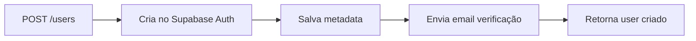
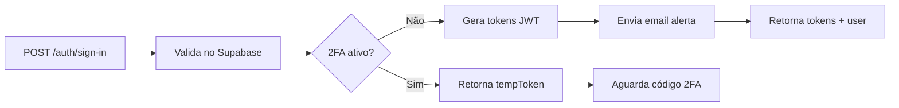
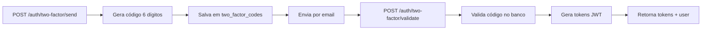

# OnTerapi v4 - Sistema de Gestão para Terapias Integrativas

## 📋 Índice
- [Sobre](#sobre)
- [Arquitetura](#arquitetura)
- [Instalação](#instalação)
- [Configuração](#configuração)
- [Desenvolvimento](#desenvolvimento)
- [Módulos](#módulos)
- [API](#api)
- [Testes](#testes)
- [Deploy](#deploy)

## 📌 Sobre

OnTerapi v4 é uma plataforma SaaS multi-tenant completa para gestão de clínicas e profissionais de terapias integrativas, com sistema de IA multi-agentes especializado.

### Principais Funcionalidades
- 🏥 Gestão completa de clínicas e profissionais
- 📅 Sistema de agendamento inteligente
- 📋 Anamnese digital com 10 etapas estruturadas
- 💊 Planos terapêuticos com IA (23 agentes especializados)
- 💰 Módulo financeiro com split automático
- 🤖 Sistema CrewAI integrado
- 📱 Portais dedicados (profissional, paciente, admin)
- 🛒 Marketplace público
- ✅ Sistema de verificação de email com tokens seguros
- 🔐 Autenticação 100% Supabase Cloud
- 📧 Alertas de login com IP e localização

## 🧪 Usuários de Teste

### Tabela de Usuários Criados

| Email | Senha | Role | CPF | Status | Observações |
|-------|-------|------|-----|--------|-------------|
| lina73@ethereal.email | Admin@123456 | SUPER_ADMIN | - | ✅ Ativo | Super administrador principal |
| patient@onterapi.com | Patient@123 | PATIENT | - | ✅ Ativo | Paciente de teste |
| professional@onterapi.com | Prof@123456 | PROFESSIONAL | - | ✅ Ativo | Profissional de saúde |
| owner@onterapi.com | Owner@123456 | CLINIC_OWNER | - | ✅ Ativo | Dono de clínica |
| secretary@onterapi.com | Secretary@123 | SECRETARY | - | ✅ Ativo | Secretária |
| admin.fin@onterapi.com | AdminFin@123 | ADMIN_FINANCEIRO | - | ✅ Ativo | Admin financeiro |
| admin.support@onterapi.com | Support@123 | ADMIN_SUPORTE | - | ✅ Ativo | Admin suporte |
| manager@onterapi.com | Manager@123 | MANAGER | - | ✅ Ativo | Gerente |
| test_verification@ethereal.email | Test@123456 | PATIENT | 76567840552 | ✅ Verificado | Teste de verificação email |

### Como Testar

1. **Login**: Use o endpoint `/auth/sign-in` com email e senha
2. **Verificação de Email**: Novos usuários recebem link de verificação que expira em 24h
3. **Refresh Token**: Use `/auth/refresh` com o refreshToken
4. **Logout**: Use `/auth/sign-out` com Bearer token
5. **Me**: Use `/auth/me` para obter dados do usuário autenticado

## 🏗️ Arquitetura

### Stack Tecnológica
- **Backend**: NestJS 10.3 + TypeScript 5.3
- **Database**: Supabase Cloud (PostgreSQL) - **SEM BANCO LOCAL**
- **ORM**: TypeORM 0.3 (apenas para estrutura, dados no Supabase)
- **Cache**: Redis 7
- **Queue**: Bull
- **Mensageria**: EventEmitter + RabbitMQ
- **Validação**: Zod 3.22
- **Auth**: Supabase Auth + JWT (100% cloud)
- **Email**: Nodemailer + Ethereal (dev) / SMTP (prod)
- **Docs**: Swagger + Compodoc
- **AI**: OpenAI + CrewAI

### Padrões Arquiteturais
- **DDD** (Domain-Driven Design)
- **Clean Architecture**
- **CQRS Pattern**
- **Event-Driven Architecture**
- **Repository Pattern**
- **Result Pattern**

### Estrutura de Módulos
```
src/
├── domain/           # Lógica de negócio pura
├── infrastructure/   # Implementações técnicas
├── modules/          # Módulos da aplicação
├── shared/           # Código compartilhado
└── core/            # Configurações globais
```

## 🚀 Instalação

### Pré-requisitos
- Node.js >= 20.0.0
- Docker >= 24.0.0 (opcional)
- Docker Compose >= 2.20.0 (opcional)
- PostgreSQL >= 16 (se não usar Docker)
- Redis >= 7 (se não usar Docker)
- npm >= 10.0.0

### Setup Inicial

#### Opção 1: Instalação Local
```bash
# Clonar repositório
git clone https://github.com/onterapi/v4.git
cd onterapi-v4

# Instalar dependências
npm install

# Configurar variáveis de ambiente
cp .env.example .env

# Rodar migrations
npm run migration:run

# Rodar seeds (dados iniciais)
npm run seed:run

# Iniciar desenvolvimento (porta 3001)
npm run dev
```

#### Opção 2: Usando Docker
```bash
# Clonar repositório
git clone https://github.com/onterapi/v4.git
cd onterapi-v4

# Build da imagem Docker
docker build -t onterapi-v4:latest .

# Iniciar com Docker Compose
docker compose up -d

# Aplicação estará disponível em http://localhost:3001
# Swagger em http://localhost:3001/api
```

### Scripts de Automação

#### Windows (PowerShell)
```powershell
# Iniciar desenvolvimento
.\docker-run.ps1 dev

# Parar containers
.\docker-run.ps1 stop

# Limpar tudo
.\docker-run.ps1 clean
```

#### Linux/Mac (Bash)
```bash
# Iniciar desenvolvimento
./docker-run.sh dev

# Parar containers
./docker-run.sh stop

# Limpar tudo
./docker-run.sh clean
```

## ⚙️ Configuração

### 🗄️ Banco de Dados - Supabase Cloud Only

**⚠️ IMPORTANTE: Este projeto NÃO usa banco de dados local. Todos os dados estão no Supabase Cloud.**

#### Configuração para Docker (Recomendado)
```env
# Use IP direto do pooler para evitar problemas de DNS no Docker
DB_HOST=54.94.90.106
DB_PORT=6543
DB_USERNAME=postgres.ogffdaemylaezxpunmop
DB_PASSWORD=5lGR6N9OyfF1fcMc
DB_DATABASE=postgres
DB_SSL=true

# Supabase Configuration
SUPABASE_URL=https://ogffdaemylaezxpunmop.supabase.co
SUPABASE_ANON_KEY=your_anon_key
SUPABASE_SERVICE_ROLE_KEY=your_service_role_key
DB_DATABASE=postgres
DB_SSL=true
DB_SCHEMA=public
```

#### APIs Supabase
```env
# URLs e Chaves
SUPABASE_URL=https://ogffdaemylaezxpunmop.supabase.co
SUPABASE_ANON_KEY=eyJhbGciOiJIUzI1NiIsInR5cCI6IkpXVCJ9...
SUPABASE_SERVICE_KEY=eyJhbGciOiJIUzI1NiIsInR5cCI6IkpXVCJ9...
SUPABASE_PROJECT_ID=ydctcvehdabvoyjunzrk
```

#### Outras Configurações
```env
# JWT
JWT_SECRET=your_jwt_secret_min_32_chars
JWT_EXPIRES_IN=7d

# OpenAI (para CrewAI)
OPENAI_API_KEY=sk-proj-...

# API
PORT=3000
NODE_ENV=development
```

### ⚠️ Segurança Supabase
- **Service Key**: NUNCA expor no frontend, apenas backend
- **Anon Key**: Pode ser usada no frontend com RLS habilitado
- **RLS**: Sempre habilitar Row Level Security em todas as tabelas
- **SSL**: Sempre usar conexão SSL em produção

## 💻 Desenvolvimento

### Scripts Disponíveis
```bash
npm run dev          # Desenvolvimento com hot-reload
npm run build        # Build para produção
npm run test         # Testes unitários
npm run test:e2e     # Testes end-to-end
npm run lint         # Linting
npm run check:dry    # Verificar violações DRY
npm run check:quality # Verificar qualidade do código
```

### Fluxo de Desenvolvimento
1. Criar branch: `git checkout -b feature/nome-feature`
2. Desenvolver seguindo padrões DDD/Clean
3. Escrever testes (mínimo 80% cobertura)
4. Validar: `npm run lint && npm run test`
5. Commit: `git commit -m "feat(module): descrição"`
6. Push e criar PR

## 📦 Módulos

### 🔐 Módulo de Autenticação (Auth)

#### Visão Geral
Sistema de autenticação 100% baseado em Supabase Cloud, sem banco de dados local. Todos os usuários e sessões são gerenciados diretamente no Supabase Auth.

#### ⚠️ IMPORTANTE: Arquitetura Cloud-Only
- **NÃO HÁ BANCO DE DADOS LOCAL**
- Todos os dados de usuários estão no Supabase Cloud
- Autenticação realizada diretamente com Supabase Auth
- User metadata armazenado no Supabase (nome, CPF, telefone, role, etc)
- Nenhuma tabela local de users ou sessions

#### Funcionalidades
- ✅ **Cadastro de usuários** direto no Supabase Auth
- ✅ **Login** com email de alerta (IP, dispositivo, localização)
- ✅ **Email de notificação** em cada login bem-sucedido
- ✅ **Two-Factor Authentication (2FA)** completo e funcional
  - Geração e envio de código de 6 dígitos por email
  - Validação com limite de 3 tentativas
  - Expiração de código em 5 minutos
  - Tabela `two_factor_codes` no Supabase Cloud
  - Integração 100% com Supabase Auth (sem banco local)
- ✅ **Refresh token** para renovação automática
- ✅ **Sistema RBAC** com 11 roles hierárquicos
- ✅ **Multi-tenant** com isolamento por tenant
- ✅ **Guards de autorização** (JWT, Roles, Tenant)
- ✅ **Verificação de email** com tokens seguros e validação real
- ✅ **Logs visuais** com links do Ethereal em desenvolvimento

#### Sistema de Roles (RBAC)
```typescript
// Roles Internos (Plataforma)
SUPER_ADMIN         // Acesso total
ADMIN_FINANCEIRO    // Gestão financeira
ADMIN_SUPORTE       // Customer success
ADMIN_EDITOR        // Marketing/conteúdo
MARKETPLACE_MANAGER // Produtos/parceiros

// Roles Externos (Clientes)
CLINIC_OWNER        // Proprietário da clínica
PROFESSIONAL        // Terapeuta
SECRETARY          // Secretária
MANAGER            // Gestor sem especialidade
PATIENT            // Paciente
VISITOR            // Visitante não autenticado
```

#### Endpoints da API

##### Autenticação
```http
POST /auth/sign-in
Body: {
  email: string,
  password: string,
  rememberMe?: boolean
}
Response: {
  accessToken: string,      // JWT válido por 15 minutos
  refreshToken: string,     // Token para renovação
  expiresIn: 900,
  user: {
    id: string,
    email: string,
    name: string,
    role: string,
    tenantId: string | null
  }
}
Efeitos: 
  - Envia email de alerta com IP, dispositivo e localização
  - Se 2FA ativo, retorna tempToken para validação

POST /auth/two-factor/send
Body: {
  tempToken: string,
  method?: 'email' | 'sms' | 'authenticator'
}
Response: {
  sentTo: string,           // Email/telefone mascarado
  method: string,
  expiresIn: 300,           // 5 minutos
  attemptsRemaining: number
}

POST /auth/two-factor/validate
Body: {
  tempToken: string,
  code: string,
  trustDevice?: boolean
}
Response: {
  accessToken: string,
  refreshToken: string,
  expiresIn: 900,
  user: { ... }
}

POST /auth/refresh
Body: {
  refreshToken: string
}
Response: {
  accessToken: string,
  refreshToken: string,
  expiresIn: 900
}

POST /auth/sign-out
Headers: Authorization: Bearer {token}
Body: {
  refreshToken?: string,
  allDevices?: boolean
}
Response: {
  success: true,
  message: string
}

GET /auth/me
Headers: Authorization: Bearer {token}
Response: {
  id: string,
  email: string,
  name: string,
  role: string,
  tenantId: string | null,
  emailVerified: boolean,
  twoFactorEnabled: boolean
}

GET /auth/verify-email?token={token}&email={email}
Response: {
  success: true,
  message: 'Email verificado com sucesso!'
}
```

#### Arquitetura do Módulo Auth
```
modules/auth/
├── api/
│   ├── controllers/        # Endpoints REST
│   ├── dtos/              # DTOs com @ApiProperty
│   └── schemas/           # Schemas Zod para validação
├── use-cases/             # Casos de uso
│   ├── sign-up.use-case.ts
│   ├── sign-in.use-case.ts
│   ├── validate-two-fa.use-case.ts
│   ├── refresh-token.use-case.ts
│   └── sign-out.use-case.ts
├── guards/                # Guards de segurança
│   ├── jwt-auth.guard.ts
│   ├── roles.guard.ts
│   └── tenant.guard.ts
├── decorators/            # Decorators customizados
│   ├── public.decorator.ts
│   ├── roles.decorator.ts
│   └── current-user.decorator.ts
└── auth.module.ts         # Módulo NestJS
```

#### Uso nos Controllers

##### Proteger rotas com autenticação
```typescript
@Controller('patients')
@UseGuards(JwtAuthGuard) // Requer autenticação
export class PatientsController {
  // Todos os endpoints requerem token JWT
}
```

##### Proteger com roles específicas
```typescript
@Post('create')
@UseGuards(JwtAuthGuard, RolesGuard)
@Roles(RolesEnum.CLINIC_OWNER, RolesEnum.PROFESSIONAL)
async createPatient() {
  // Apenas CLINIC_OWNER e PROFESSIONAL podem acessar
}
```

##### Rotas públicas
```typescript
@Get('public-info')
@Public() // Não requer autenticação
async getPublicInfo() {
  // Endpoint público
}
```

#### 📧 Sistema de Emails

##### Configuração
```env
# Desenvolvimento (Ethereal - emails de teste)
EMAIL_HOST=smtp.ethereal.email
EMAIL_PORT=587
EMAIL_USER=lina73@ethereal.email
EMAIL_PASS=bZdVJ4VJdP46V6w5jx
EMAIL_FROM=noreply@onterapi.com

# Produção (configurar seu SMTP)
EMAIL_HOST=smtp.gmail.com
EMAIL_PORT=587
EMAIL_USER=seu-email@gmail.com
EMAIL_PASS=sua-senha-app
EMAIL_FROM=noreply@onterapi.com
```

##### Emails Enviados pelo Sistema

###### 1. Email de Alerta de Login
- **Quando**: Sempre que um usuário faz login
- **Conteúdo**: IP, dispositivo, navegador, localização, data/hora
- **Template**: HTML responsivo com informações detalhadas
- **Logs**: Link do Ethereal para visualização em desenvolvimento

###### 2. Email de Verificação
- **Quando**: Novo cadastro de usuário
- **Conteúdo**: Link para verificar email
- **Validade**: 24 horas

###### 3. Email de Código 2FA
- **Quando**: Login com 2FA ativado
- **Conteúdo**: Código de 6 dígitos
- **Validade**: 5 minutos

###### 4. Email de Boas-Vindas
- **Quando**: Após verificação do email
- **Conteúdo**: Informações sobre a plataforma

#### 🔄 Fluxo de Autenticação Completo

##### 1. Cadastro de Novo Usuário


##### 2. Login Normal


##### 3. Login com 2FA


**Fluxo Detalhado do 2FA:**
1. Login detecta `twoFactorEnabled: true` no user_metadata
2. Retorna `requiresTwoFactor: true` com `tempToken`
3. Cliente envia tempToken para `/auth/two-factor/send`
4. Sistema gera código de 6 dígitos e salva no Supabase
5. Email enviado com código (válido por 5 minutos)
6. Cliente envia código para `/auth/two-factor/validate`
7. Sistema valida código e retorna tokens completos

#### 🐳 Configuração Docker

##### docker-compose.yml
```yaml
services:
  app:
    build: .
    ports:
      - "3001:3000"
    dns:
      - 8.8.8.8
      - 8.8.4.4
    extra_hosts:
      - "ogffdaemylaezxpunmop.supabase.co:104.18.38.10"
      - "aws-0-sa-east-1.pooler.supabase.com:54.94.90.106"
      - "smtp.ethereal.email:95.216.108.161"
    environment:
      NODE_OPTIONS: "--dns-result-order=ipv4first"
```

**Nota**: Os extra_hosts são necessários para resolver DNS dentro do container Docker.

##### Obter usuário atual
```typescript
@Get('profile')
@UseGuards(JwtAuthGuard)
async getProfile(@CurrentUser() user: ICurrentUser) {
  // user contém: id, email, name, role, tenantId
  return user;
}
```

### 👥 Módulo de Usuários (Users)

#### Visão Geral
CRUD completo de usuários com permissões granulares, integração com Supabase Auth e validações rigorosas.

#### Funcionalidades
- ✅ **Create**: Cadastro público ou via admin
- ✅ **Read**: Busca por ID (próprio ou admin)
- ✅ **Update**: Atualização de dados (próprio ou admin)
- ✅ **Delete**: Soft delete mantendo histórico
- ✅ **List**: Listagem com filtros (apenas admin)
- ✅ **Validações**: CPF único, email único, senha forte
- ✅ **Integração Supabase**: Sincronização automática
- ✅ **Paginação**: Em todas as listagens
- ✅ **Filtros**: Por role, tenant, status ativo

#### Permissões dos Endpoints

| Endpoint | Método | Descrição | Permissão | Status |
|----------|--------|-----------|-----------|---------|
| `/users` | POST | Criar usuário | Público OU Admin | ✅ Funcionando |
| `/users` | GET | Listar todos | SUPER_ADMIN, ADMIN_SUPORTE | ✅ Funcionando |
| `/users/:id` | GET | Buscar por ID | Admin OU próprio usuário | ⚠️ Retorna vazio |
| `/users/:id` | PATCH | Atualizar parcial | Admin OU próprio usuário | ✅ Funcionando |
| `/users/:id` | PUT | Atualizar completo | Admin OU próprio usuário | ❌ Não implementado |
| `/users/:id` | DELETE | Deletar (soft) | SUPER_ADMIN | ✅ Funcionando |

#### Endpoints da API

##### Criar Usuário
```http
POST /users
Body: {
  email: string,
  password: string,  // Mínimo 8 chars, maiúscula, minúscula, número, especial
  name: string,
  cpf: string,       // Apenas números, validado
  phone?: string,    // Opcional, formato brasileiro
  role: RolesEnum,
  tenantId?: string  // UUID da clínica
}
```

##### Listar Usuários (Admin Only)
```http
GET /users?page=1&limit=20&role=PATIENT&tenantId=uuid&isActive=true
Headers: Authorization: Bearer {admin_token}
```

##### Buscar Usuário
```http
GET /users/:id
Headers: Authorization: Bearer {token}
```

##### Atualizar Usuário
```http
PATCH /users/:id
Headers: Authorization: Bearer {token}
Body: {
  name?: string,
  phone?: string,
  isActive?: boolean,
  metadata?: object
}
```

##### Deletar Usuário
```http
DELETE /users/:id
Headers: Authorization: Bearer {token}
```

#### Arquitetura do Módulo Users
```
modules/users/
├── api/
│   ├── controllers/        # Endpoints REST
│   ├── dtos/              # DTOs com Swagger
│   └── schemas/           # Validação Zod
├── use-cases/
│   ├── create-user.use-case.ts
│   ├── find-all-users.use-case.ts
│   ├── find-user-by-id.use-case.ts
│   ├── update-user.use-case.ts
│   └── delete-user.use-case.ts
├── guards/
│   └── user-owner.guard.ts  # Verifica se é admin ou dono
└── users.module.ts
```

#### Guards de Segurança

##### JwtAuthGuard
- Valida tokens JWT
- Extrai metadata do usuário do Supabase
- **IMPORTANTE**: Corrigido em v0.5.1 para extrair corretamente o role do user_metadata

##### RolesGuard
- Verifica hierarquia de permissões
- Funciona em conjunto com @Roles decorator

##### UserOwnerGuard
Guard especial que permite acesso se:
- Usuário é admin (SUPER_ADMIN, ADMIN_SUPORTE, ADMIN_FINANCEIRO)
- Usuário está acessando seus próprios dados

```typescript
@Get(':id')
@UseGuards(JwtAuthGuard, UserOwnerGuard)
async findOne(@Param('id') id: string) {
  // Admin ou próprio usuário podem acessar
}
```

#### Configuração Necessária

##### Variáveis de Ambiente
```env
# JWT Secrets
JWT_ACCESS_SECRET=your_access_secret_min_32_chars
JWT_REFRESH_SECRET=your_refresh_secret_min_32_chars
JWT_2FA_SECRET=your_2fa_secret_min_32_chars

# Supabase Auth (OBRIGATÓRIO)
SUPABASE_URL=https://your-project.supabase.co
SUPABASE_ANON_KEY=your_anon_key_here
SUPABASE_SERVICE_ROLE_KEY=your_service_role_key_here

# App Config
APP_URL=http://localhost:3000
APP_NAME=OnTerapi
```

##### Dependências Necessárias
```json
{
  "@supabase/supabase-js": "^2.x",
  "speakeasy": "^2.x",      // Para 2FA TOTP
  "qrcode": "^1.x",         // Para gerar QR Code
  "bcryptjs": "^2.x",       // Hash de senhas
  "@nestjs/jwt": "^10.x",   // JWT
  "@nestjs/passport": "^10.x"
}
```

### Outros Módulos Principais
- **Patients**: Gestão de pacientes
- **Appointments**: Sistema de agendamento
- **Anamnesis**: Anamnese digital
- **Consultations**: Gestão de consultas
- **TherapeuticPlans**: Planos com IA
- **Financial**: Pagamentos e split
- **Clinics**: Gestão multi-clínica
- **CrewAI**: Integração com 23 agentes

## 📊 API Documentation

### Swagger
Disponível em desenvolvimento: `http://localhost:3001/api`

### Endpoints Principais
- `POST /auth/login` - Autenticação
- `GET /patients` - Listar pacientes
- `POST /appointments` - Criar agendamento
- `GET /anamnesis/:id` - Buscar anamnese
- `POST /therapeutic-plans` - Gerar plano com IA

## 🧪 Testes

### Executar Testes
```bash
npm run test         # Unitários
npm run test:watch   # Watch mode
npm run test:cov     # Coverage
npm run test:e2e     # End-to-end
```

### Cobertura Mínima
- Unitários: 80%
- Integração: 70%
- E2E: Fluxos críticos

## 🐳 Docker

### Configuração Docker
O projeto está totalmente containerizado para facilitar desenvolvimento e deploy.

#### Docker Compose
```yaml
version: '3.8'

services:
  app:
    build:
      context: .
      dockerfile: Dockerfile
    container_name: onterapi-app
    ports:
      - "3001:3000"
    environment:
      NODE_ENV: ${NODE_ENV:-development}
      NODE_OPTIONS: "--dns-result-order=ipv4first"
    env_file:
      - .env
    volumes:
      - ./src:/app/src:delegated
      - ./logs:/app/logs
    depends_on:
      - redis
    networks:
      - onterapi-network
    restart: unless-stopped

  redis:
    image: redis:7-alpine
    container_name: onterapi-redis
    ports:
      - "6379:6379"
    command: redis-server --requirepass ${REDIS_PASSWORD:-onterapi_redis_2024}
    volumes:
      - redis-data:/data
    networks:
      - onterapi-network
    restart: unless-stopped

volumes:
  redis-data:

networks:
  onterapi-network:
    driver: bridge
```

#### Comandos Docker
```bash
# Build da imagem
docker build -t onterapi-v4:latest .

# Iniciar com Docker Compose
docker compose up -d

# Ver logs
docker compose logs -f

# Parar serviços
docker compose stop

# Remover tudo
docker compose down -v

# Executar comandos no container
docker compose exec app npm run migration:run
docker compose exec app npm test
```

### Troubleshooting Docker

#### Erro IPv6
Se encontrar erro `Error: connect ENETUNREACH 2600:...`, use o Supabase Pooler:
```env
# Use Pooler para IPv4
DB_HOST=aws-0-sa-east-1.pooler.supabase.com
DB_PORT=6543
DB_USERNAME=postgres.ogffdaemylaezxpunmop
NODE_OPTIONS=--dns-result-order=ipv4first
```

## 🔄 CI/CD

### Pipeline
1. **Lint & Format**: Validação de código
2. **Tests**: Unitários e integração
3. **Build**: Compilação TypeScript
4. **Security**: Scan de vulnerabilidades
5. **Deploy**: Staging → Production

## 📝 Changelog

Veja [CHANGELOG.md](./CHANGELOG.md) para histórico de mudanças.

## 📄 Licença

Proprietary - OnTerapi © 2024. Todos os direitos reservados.

## 🤝 Contribuindo

1. Siga os padrões definidos em `.claude/agent-onterapi.md`
2. Use commits semânticos
3. Mantenha cobertura de testes
4. Atualize documentação

## 📞 Suporte

- Email: dev@onterapi.com.br
- Docs: https://docs.onterapi.com.br

---

*OnTerapi v4 - Desenvolvido com princípios DDD e Clean Architecture*