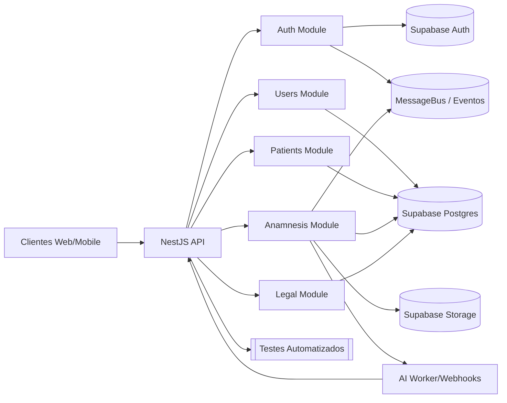

# OnTerapi 

Plataforma SaaS multi-tenant para gestao de clinicas e terapeutas, com Supabase Auth, 2FA, RBAC e modulo de pacientes conectado diretamente ao storage do Supabase.

## Sumario
- [Visao Geral](#visao-geral)
- [Credenciais de Teste](#credenciais-de-teste)
- [Fluxo de Autenticacao](#fluxo-de-autenticacao)
- [Modulo de Pacientes](#modulo-de-pacientes)
- [Modulo de Usuarios](#modulo-de-usuarios)
- [Modulo de Anamnese](#modulo-de-anamnese)
- [Modulo de Agendamento](#modulo-de-agendamento)
- [Exportacao de Pacientes](#exportacao-de-pacientes)
- [Documentacao Swagger](#documentacao-swagger)
- [Como Rodar Localmente](#como-rodar-localmente)
- [Testes Manuais Recomendados](#testes-manuais-recomendados)
- [Guia para Novos Modulos](#guia-para-novos-modulos)
- [Matriz de Testes Automatizados](#matriz-de-testes-automatizados)
- [Fluxo Completo de Teste via cURL](#fluxo-completo-de-teste-via-curl)
- [Troubleshooting](#troubleshooting)
- [Linha de Base de Qualidade](#linha-de-base-de-qualidade)
- [Fluxograma do Projeto](#fluxograma-do-projeto)

## Visao Geral
- NestJS 10 + TypeScript 5 + Result Pattern
- Supabase Cloud (PostgreSQL + Auth) como camada de dados principal
- TypeORM apenas para entidades/seed de apoio (sem banco local)
- JWT proprio (access/refresh) + 2FA por email
- MessageBus + eventos de dominio para auditar autenticao e pacientes
- DRY/Clean Architecture com BaseUseCase, BaseGuard e MessageBus unificados

## Credenciais de Teste
Não mantemos mais credenciais padrão em repositório. Gere usuários administrativos manualmente via `/users` e armazene os acessos em um cofre seguro.

> Para fluxos locais, utilize os dados de ambiente em `./.env` e gere o 2FA pelo endpoint `/auth/two-factor/send` quando necessário.

## Fluxo de Autenticacao
1. `POST /auth/sign-in` com email/senha. Super admin exige 2FA automaticamente.
2. `POST /auth/two-factor/send` com `tempToken` recebido.
3. Buscar codigo 2FA em `two_factor_codes` (via Supabase REST) ou pelo painel Resend ou caixa de entrada configurada.
4. `POST /auth/two-factor/validate` com `tempToken` + `code`.
5. A partir do access token:
   - `GET /auth/me`
   - `POST /auth/refresh` com refresh token
   - `POST /auth/sign-out` (opcionalmente `{ "allDevices": true }`) agora cancela tambem as sessoes Supabase quando possivel e ignora tokens invalidos sem log de erro.

### Logs e Auditoria
- Todos os eventos (sign-in, 2FA enviado/validado, logout) sao publicados via `MessageBus`.
- Guardas `JwtAuthGuard`, `RolesGuard` e `TenantGuard` foram revisados para usar o contexto completo do usuario.

### Recuperacao e verificacao
- `POST /auth/verification/resend` reenvia o email de verificacao para contas pendentes; exige email valido e respeita limites de tentativa.
- `POST /auth/password/reset/request` gera token de redefinicao e aciona o email via Resend; protecao contra enumeration habilitada.
- `POST /auth/password/reset/confirm` aplica a troca de senha com o token recebido, invalida refresh tokens anteriores e registra o evento de auditoria.

## Modulo de Pacientes
- CRUD completo persistido na tabela `patients` do Supabase.
- Filtros suportados: `status`, `riskLevel`, `tags`, `query`, paginacao e ordenacao (`createdAt`, `updatedAt`, `fullName`).
- Transferencia, arquivamento e restauro respeitam roles (somente OWNER/MANAGER/SUPER_ADMIN).
- Validacao de CPF (duplicidade por tenant) com mensagens traduzidas.
- Campos clinicos adicionais armazenados: condicoes pre-existentes, medicacao continua (nome/dosagem/frequencia/condicao), altura (cm), peso (kg) e aceite obrigatorio de termos de uso para novos pacientes.
- DTOs e schemas (Zod) garantem payload limpo.

Rotas principais:
- `GET /patients` Lista paginada.
- `POST /patients` Cria paciente (CPF unico por tenant).
- `GET /patients/:slug` Retorna resumo, timeline (stub) e insights (stub).
- `PATCH /patients/:slug` Atualiza dados basicos, tags, professionalId.
- `POST /patients/:slug/transfer` Transferencia entre profissionais.
- `POST /patients/:slug/archive` Arquiva/soft-delete e bloqueia edicao.

## Modulo de Usuarios
- `GET /users` visivel apenas para SUPER_ADMIN.
- Cria usuarios com Supabase Auth (`POST /users`). Email precisa ser confirmado antes de login.
- Rotas de leitura/edicao usam slug estavel (`GET /users/:slug`, `PATCH /users/:slug`, `DELETE /users/:slug`).
- Atualizacoes refletem metadata e sessoes (`user_sessions`) para refresh tokens.
- Script `npm run backfill:user-slugs` sincroniza o slug do banco relacional com o metadata do Supabase Auth para contas legadas.
- Script `npm run sync:users` garante que apenas os usuarios presentes no Postgres estejam registrados no Supabase Auth (executa insert/update e remove contas extras).
- Script `npm run assign-super-admin-tenant` vincula o tenant padrao aos SUPER_ADMIN no Supabase e atualiza a coluna tenant_id da base relacional.

## Modulo de Anamnese

### Visao Geral
- Formulario clinico multi-etapas (10 steps) utilizado antes da consulta para consolidar dados do paciente, alimentar a IA e registrar historico auditavel.
- Suporta rascunhos idempotentes, anexos versionados, geracao de plano terapeutico, feedback supervisionado e metricas de conclusao.
- Cancelamento soft delete preserva auditoria (`deletedAt`, `deletedBy`, `deletedReason`) e remove registros das listagens padrao.
- Todo fluxo utiliza os guards `JwtAuthGuard`, `TenantGuard` e `RolesGuard`, devolvendo as respostas formatadas pelo `AnamnesisPresenter`.

### Autenticacao e Cabecalhos
- `Authorization: Bearer <accessToken>` obrigatorio para todas as rotas autenticadas; o webhook de IA e marcado com `@Public`, mas ainda passa pelo `AnamnesisAIWebhookGuard`.
- `x-tenant-id: <uuid>` obrigatorio. Para rotas autenticadas o guard usa `currentUser.tenantId` como fallback, enquanto o webhook exige o header explicitamente.
- Roles permitidas:
  - `PATIENT` acessa apenas a propria anamnese.
  - `PROFESSIONAL`, `CLINIC_OWNER` e `MANAGER` executam todas as operacoes do modulo.
  - `SUPER_ADMIN` possui acesso total.
  - `SECRETARY` e `FINANCE` nao sao autorizados.

### Enumeracoes Principais
- `AnamnesisStatus`: `draft`, `submitted`, `completed`, `cancelled`.
- `AnamnesisStepKey`: `identification`, `chiefComplaint`, `currentDisease`, `pathologicalHistory`, `familyHistory`, `systemsReview`, `lifestyle`, `psychosocial`, `medication`, `physicalExam`.
- `approvalStatus` (feedback): `approved`, `modified`, `rejected`.

### Fluxo Sugerido no Swagger
1. `POST /anamneses/start` cria ou recupera o rascunho vinculado a consulta.
2. `PUT /anamneses/{anamnesisId}/steps/{stepNumber}` e `POST /anamneses/{anamnesisId}/auto-save` alimentam cada etapa.
3. `POST /anamneses/{anamnesisId}/attachments` (opcional) envia exames e documentos.
4. `POST /anamneses/{anamnesisId}/submit` valida o preenchimento e dispara a fila da IA.
5. `POST /anamneses/{anamnesisId}/plan` registra o plano recebido; `POST /anamneses/{anamnesisId}/plan/feedback` guarda o parecer humano.
6. Consultas subsequentes usam `GET /anamneses/{anamnesisId}` e `GET /anamneses/patient/{patientId}`.

> Schemas Zod e DTOs: `src/modules/anamnesis/api/schemas/anamnesis.schema.ts` e `src/modules/anamnesis/api/dtos/`.
### IA Assistida e Aceite Legal
> Endpoints locais expõem as rotas diretamente em `http://localhost:3000` (sem prefixo `/api/v1`). Configure o gateway/proxy externo se precisar de versionamento no caminho.

- Worker consome `ANAMNESIS_AI_REQUESTED`, monta prompt a partir de `compactAnamnesis` + `patientRollup` e envia o resultado para `POST /anamneses/:id/ai-result`.
- Modo local opcional (`ANAMNESIS_AI_WORKER_MODE=local`) gera plano assistivo internamente e chama o mesmo webhook.
- Configure `ANAMNESIS_AI_WORKER_URL`, `ANAMNESIS_AI_WORKER_TOKEN` (opcional), `ANAMNESIS_AI_PROMPT_VERSION` e `ANAMNESIS_AI_WORKER_TIMEOUT_MS` para habilitar o disparo HTTP do worker externo.
- Worker de referência: use `npm run worker:start` para subir o servidor Express que recebe os jobs e encaminha o resultado para o webhook. Configure `ANAMNESIS_AI_WEBHOOK_BASE_URL`/`ANAMNESIS_AI_WEBHOOK_SECRET` e defina `ANAMNESIS_AI_PROVIDER=openai|local`.
- Variáveis adicionais do worker: `ANAMNESIS_AI_WORKER_PORT`, `ANAMNESIS_AI_WORKER_MAX_RETRIES`, `ANAMNESIS_AI_WORKER_TIMEOUT_MS`, `OPENAI_API_KEY`, `OPENAI_MODEL`, `OPENAI_TEMPERATURE`. Consulte `.env.example` para a lista completa.
- Configure `ANAMNESIS_AI_WEBHOOK_MAX_SKEW_MS` quando necessário para ajustar a janela de tolerância do timestamp da assinatura (padrão 5 minutos).
- O worker assina o webhook via HMAC-SHA256 usando `x-anamnesis-ai-timestamp` + `x-anamnesis-ai-signature` (payload `timestamp.body`), replica `x-tenant-id` e envia `tokensInput`, `tokensOutput` e `latencyMs` reais no retorno.
- Webhook persiste metadados do modelo (planText, reasoningText, evidenceMap, tokens, latência, rawResponse) e materializa o plano com status `generated`.
- Aceite (`POST /anamneses/:id/plan`) exige `termsVersion`, `termsTextSnapshot`, grava histórico em `therapeutic_plan_acceptances` e recalcula `patient_anamnesis_rollups`.
- Fluxo, payloads e checklist da integração ficam detalhados nas seções abaixo.
- As metricas do pipeline (passos salvos, submissoes, tokens, custo, feedback) sao persistidas em `anamnesis_metrics` por tenant/dia; `AnamnesisMetricsService.getSnapshot()` agrega direto do banco e aceita janelas customizadas.
- Endpoint `GET /anamneses/metrics` disponibiliza o snapshot consolidado usando o mesmo servico; aceita `from`/`to` (ISO) para limitar o intervalo e `tenantId` apenas para perfis internos (SUPER_ADMIN) inspecionarem outros tenants.
- Ajuste `ANAMNESIS_AI_COST_TOKEN_INPUT`/`ANAMNESIS_AI_COST_TOKEN_OUTPUT` para refletir o custo por token e `ANAMNESIS_AI_LATENCY_ALERT_MS` para alertas operacionais.
- Termos legais versionados usam status `draft`/`published`/`retired`, mantendo `createdBy`, `publishedBy` e `retiredBy` para auditoria e restringindo um termo `published` por `(tenant, context)`.

#### Fluxo Submit → IA → Aceite
1. `POST /anamneses/:id/submit` compacta os dados e emite `ANAMNESIS_SUBMITTED`.  
2. Worker externo (ou modo local) consome `ANAMNESIS_AI_REQUESTED`, monta o prompt com o rollup anterior + anamnese atual e chama o provedor de IA.  
3. A resposta chega via `POST /anamneses/:id/ai-result`, assinada com HMAC; o backend persiste plano e métricas (tokens, latência, status).  
4. Profissional revisa/aceita (`POST /anamneses/:id/plan`), salvando snapshot de termos em `therapeutic_plan_acceptances`, status `accepted` e rollup incremental (`patient_anamnesis_rollups`).  
5. Feedback opcional (`POST /anamneses/:id/plan/feedback`) alimenta o scoreboard (`anamnesis_ai_feedbacks`).  
6. Exibições do plano são logadas em `therapeutic_plan_access_logs` para auditoria.

#### Payloads do Worker de IA
**Job enviado ao worker**
```json
{
  "analysisId": "d64ad7c4-0dc4-4c30-b8c2-c4030e845391",
  "anamnesisId": "f5c07fb8-9aa1-4bc3-8e2b-3bb6f460d452",
  "tenantId": "645d883f-535a-4c3e-9d93-4f1204bd489d",
  "systemPrompt": "...",
  "userPrompt": "...",
  "compact": { "patientProfile": { "...": "..." }, "visit": { "...": "..." } },
  "rollupSummary": { "version": 3, "summaryText": "..." },
  "metadata": { "requestedAt": "2025-10-02T12:21:04.512Z", "correlationId": "..." }
}
```

**Resposta esperada da IA**
```json
{
  "plan_text": "1) Fitoterápico X ...",
  "reasoning_text": "Recomenda-se X ...",
  "confidence": 0.78,
  "evidence_map": [
    {
      "recommendation": "Fitoterápico X",
      "evidence": ["insônia atual", "estresse elevado"],
      "confidence": 0.72
    }
  ],
  "tokens_input": 842,
  "tokens_output": 612,
  "latency_ms": 1820,
  "model": "gpt-4o-mini-2025-09-01",
  "prompt_version": "therapeutic-plan/v3",
  "raw_response": { "...": "..." }
}
```

#### Webhook `/anamneses/:id/ai-result`
- Headers obrigatórios: `x-anamnesis-ai-signature`, `x-anamnesis-ai-timestamp`, `Content-Type: application/json` e, idealmente, `x-tenant-id`.  
- Assinatura HMAC-SHA256 sobre `timestamp.body` usando `ANAMNESIS_AI_WEBHOOK_SECRET`:  
  ```
  payload = `${timestamp}.${jsonBody}`
  signature = sha256(payload, secret)
  header = `sha256=${signatureHex}`
  ```
- Janela de tolerância configurável via `ANAMNESIS_AI_WEBHOOK_MAX_SKEW_MS` (5 minutos por padrão).  
- Replays bloqueados por `analysisId` + assinatura na tabela `anamnesis_ai_webhook_requests`, registrada pelo `AnamnesisAIWebhookReplayService`.

#### Métricas Persistidas
`anamnesis_metrics` agrega diariamente por tenant:

| Campo                        | Descrição                                           |
|------------------------------|-----------------------------------------------------|
| `steps_saved`, `auto_saves`  | Contagem de passos salvos/auto-saves                |
| `submissions`                | Número de submissões + completude acumulada         |
| `ai_completed` / `ai_failed` | Resultado da IA (sucesso/falha)                     |
| `tokens_input_sum/_output`   | Tokens consumidos (entrada/saída)                   |
| `ai_latency_sum/_count/_max` | Latência média e máxima (ms)                        |
| `ai_cost_sum`                | Custo estimado via `ANAMNESIS_AI_COST_TOKEN_*`      |
| `feedback_*`                 | Aprovações, modificações, rejeições, likes/dislikes |

Use `AnamnesisMetricsService.getSnapshot([tenantId])` ou o endpoint `GET /anamneses/metrics` para dashboards e SLA (ambos aceitam recortes por intervalo).

#### Governança de Termos Legais
- `legal_terms` armazena `status (draft|published|retired)`, `createdBy`, `publishedBy`, `retiredBy`, `publishedAt` e `retiredAt`.  
- Restrição: somente um termo `published` por `(tenant, context)`; para `therapeutic_plan` usamos a versão global seedada (`v1.0`).  
- `/legal/terms` expõe CRUD multi-tenant (listar, criar, publicar, retirar).  
- Aceite de plano exige `termsVersion` matching + snapshot idêntico; histórico de aceites em `therapeutic_plan_acceptances`.


### Endpoints Detalhados

#### GET /anamneses/templates
- Roles: PROFESSIONAL, CLINIC_OWNER, MANAGER, SUPER_ADMIN, PATIENT.
- Query (`ListStepTemplatesQuerySchema`):
| Query | Tipo | Obrigatorio | Descricao |
| --- | --- | --- | --- |
| `specialty` | string | nao | Prioriza templates cadastrados para a especialidade. |
| `includeInactive` | boolean | nao | Quando `true`, retorna templates inativos para auditoria. |
- Resposta: array de `AnamnesisStepTemplateDto` com `id`, `key`, `title`, `schema`, `version`, `specialty`, `isActive`, `createdAt`, `updatedAt`.
```json
[
  {
    "id": "template-identification",
    "key": "identification",
    "title": "Identificacao",
    "schema": { "fields": [] },
    "version": 1,
    "specialty": "default",
    "isActive": true,
    "createdAt": "2025-09-26T00:00:00.000Z"
  }
]
```

#### POST /anamneses/start
- Roles: PROFESSIONAL, CLINIC_OWNER, MANAGER, SUPER_ADMIN, PATIENT.
- Body (`StartAnamnesisRequestDto`):
| Campo | Tipo | Obrigatorio | Descricao |
| --- | --- | --- | --- |
| `consultationId` | uuid | sim | Consulta relacionada. |
| `patientId` | uuid | sim | Paciente que respondera a anamnese. |
| `professionalId` | uuid | sim | Profissional responsavel pela consulta. |
| `totalSteps` | inteiro (1-50) | nao | Quantidade total de etapas disponiveis. |
| `initialStep` | inteiro | nao | Etapa inicial a ser exibida. |
| `formData` | objeto | nao | Dados iniciais para pre-preenchimento. |
- Resposta (`AnamnesisDetailResponseDto`):
```json
{
  "id": "5c4a...",
  "consultationId": "c1d2...",
  "patientId": "p1d2...",
  "professionalId": "8799...",
  "tenantId": "1111...",
  "status": "draft",
  "totalSteps": 10,
  "currentStep": 1,
  "completionRate": 0,
  "isDraft": true,
  "steps": [],
  "latestPlan": null,
  "attachments": []
}
```

#### GET /anamneses/{anamnesisId}
- Roles: PROFESSIONAL, CLINIC_OWNER, MANAGER, SUPER_ADMIN, PATIENT (somente a propria).
- Query (`GetAnamnesisQuerySchema`):
| Query | Tipo | Obrigatorio | Descricao |
| --- | --- | --- | --- |
| `includeSteps` | boolean | nao | Inclui a lista de steps preenchidos. |
| `includeLatestPlan` | boolean | nao | Retorna o plano terapeutico mais recente. |
| `includeAttachments` | boolean | nao | Retorna anexos vinculados. |
- Resposta: `AnamnesisDetailResponseDto` com `steps`, `latestPlan` e `attachments` quando solicitados.

#### PUT /anamneses/{anamnesisId}/steps/{stepNumber}
- Roles: PROFESSIONAL, CLINIC_OWNER, MANAGER, SUPER_ADMIN, PATIENT (proprio).
- Path: `stepNumber` (inteiro 1-50).
- Body (`SaveAnamnesisStepRequestDto`):
| Campo | Tipo | Obrigatorio | Descricao |
| --- | --- | --- | --- |
| `key` | string (`AnamnesisStepKey`) | sim | Identifica a etapa. |
| `payload` | objeto | sim | Dados preenchidos no passo. |
| `completed` | boolean | nao | Marca o passo como finalizado. |
| `hasErrors` | boolean | nao | Indica erros de validacao. |
| `validationScore` | numero (0-100) | nao | Score calculado pelo front/IA. |
- Resposta: `AnamnesisDetailResponseDto` com progresso atualizado.

#### POST /anamneses/{anamnesisId}/auto-save
- Mesmas roles e DTO baseando-se em `AutoSaveAnamnesisStepRequestDto` (inclui `stepNumber` e `autoSavedAt` ISO).
- Resposta: `AnamnesisDetailResponseDto` mantendo o status `draft`.

#### POST /anamneses/{anamnesisId}/submit
- Roles: PROFESSIONAL, CLINIC_OWNER, MANAGER, SUPER_ADMIN.
- Sem body. Retorna `AnamnesisDetailResponseDto` com `status` = `submitted` e `submittedAt` preenchido.

#### POST /anamneses/{anamnesisId}/cancel
- Roles: PROFESSIONAL, CLINIC_OWNER, MANAGER, SUPER_ADMIN.
- Body opcional (CancelAnamnesisRequestDto):
| Campo | Tipo | Obrigatorio | Descricao |
| --- | --- | --- | --- |
| `reason` | string (1-1000) | nao | Justificativa registrada no cancelamento. |
- Resposta: HTTP 204 (sem corpo). Registro permanece para auditoria (`deletedAt`, `deletedBy`, `deletedReason`) e deixa de aparecer nas listagens e historico padrao.

#### POST /anamneses/{anamnesisId}/plan
- Roles: PROFESSIONAL, CLINIC_OWNER, MANAGER, SUPER_ADMIN.
- Body (`SaveTherapeuticPlanRequestDto`):
| Campo | Tipo | Obrigatorio | Descricao |
| --- | --- | --- | --- |
| `clinicalReasoning` | string | nao | Raciocinio clinico gerado. |
| `summary` | string | nao | Resumo apresentado ao paciente. |
| `therapeuticPlan` | objeto | nao | Representacao estruturada do plano. |
| `riskFactors` | array | nao | Lista de fatores de risco (`id`, `description`, `severity`). |
| `recommendations` | array | nao | Lista de recomendacoes (`id`, `description`, `priority`). |
| `confidence` | numero (0-1) | nao | Confianca da IA. |
| `reviewRequired` | boolean | nao | Indica necessidade de revisao humana. |
| `termsAccepted` | boolean | sim | Confirma que o profissional assume a responsabilidade de revisar o plano gerado por IA antes de utiliza-lo com o paciente. |
| `generatedAt` | string ISO | sim | Momento em que a IA concluiu a analise. |
- Resposta: `TherapeuticPlanDto` com ids, feedback, timestamps e metadados.

#### POST /anamneses/{anamnesisId}/plan/feedback
- Roles: PROFESSIONAL, CLINIC_OWNER, MANAGER, SUPER_ADMIN.
- Body (`SavePlanFeedbackRequestDto`): campos `approvalStatus`, `liked`, `feedbackComment`.
- Resposta: `TherapeuticPlanDto` atualizado com feedback humano (`approvalStatus`, `liked`, `feedbackGivenBy`, `feedbackGivenAt`).

#### GET /anamneses/patient/{patientId}
- Roles: PROFESSIONAL, CLINIC_OWNER, MANAGER, SUPER_ADMIN, PATIENT (proprio).
- Query (`ListAnamnesesQuerySchema`):
| Query | Tipo | Obrigatorio | Descricao |
| --- | --- | --- | --- |
| `status` | string ou array | nao | Lista de status validos (`draft`, `submitted`, `completed`, `cancelled`). |
| `professionalId` | uuid | nao | Filtra pelo responsavel. |
| `from` | string ISO | nao | Data/hora inicial (UTC). |
| `to` | string ISO | nao | Data/hora final (UTC). |
- Resposta: array de `AnamnesisListItemDto` (id, consultationId, patientId, professionalId, status, completionRate, submittedAt, updatedAt).

#### GET /anamneses/patient/{patientId}/history
- Roles: PROFESSIONAL, CLINIC_OWNER, MANAGER, SUPER_ADMIN, PATIENT.
- Query (`AnamnesisHistoryQuerySchema`):
| Query | Tipo | Obrigatorio | Descricao |
| --- | --- | --- | --- |
| `limit` | inteiro (1-50) | nao | Limita quantidade de registros. |
| `status` | string ou array | nao | Filtra por status validos. |
| `includeDrafts` | boolean | nao | Inclui anamneses em rascunho. |
- Resposta: `AnamnesisHistoryResponseDto` com `entries` (steps, anexos, plano) e `prefill` reutilizavel.

#### POST /anamneses/{anamnesisId}/attachments
- Roles: PROFESSIONAL, CLINIC_OWNER, MANAGER, SUPER_ADMIN, PATIENT.
- Consome `multipart/form-data` (`CreateAnamnesisAttachmentRequestDto`): campo `file` (binario, max 10 MB), `stepNumber` opcional, `fileName` opcional.
- Resposta: `AnamnesisAttachmentDto` (`id`, `fileName`, `mimeType`, `size`, `storagePath`, `uploadedBy`, `uploadedAt`).

#### DELETE /anamneses/{anamnesisId}/attachments/{attachmentId}
- Mesmas roles. Retorna HTTP 204 e emite `DomainEvents.ANAMNESIS_ATTACHMENT_REMOVED`.

#### POST /anamneses/{anamnesisId}/ai-result
- `@Public` + `AnamnesisAIWebhookGuard` (valida assinatura e exige `x-tenant-id`).
- Body (`ReceiveAIResultRequestDto`):
| Campo | Tipo | Obrigatorio | Descricao |
| --- | --- | --- | --- |
| `analysisId` | uuid | sim | Identificador da análise solicitada. |
| `status` | enum (`completed`, `failed`) | sim | Resultado retornado pelo provider. |
| `respondedAt` | string ISO | sim | Momento da resposta da IA. |
| `clinicalReasoning` | string | nao | Raciocínio textual da IA. |
| `summary` | string | nao | Resumo curto para cards/listas. |
| `therapeuticPlan` | objeto | nao | Plano estruturado compatível com versões anteriores. |
| `riskFactors` | array | nao | Fatores de risco (estrutura herdada). |
| `recommendations` | array | nao | Recomendações sugeridas (estrutura herdada). |
| `planText` | string | nao | Plano em texto corrido para exibição direta. |
| `reasoningText` | string | nao | Raciocínio clínico em texto corrido. |
| `evidenceMap` | array | nao | Mapa `{ recommendation, evidence[], confidence }`. |
| `confidence` | numero (0-1) | nao | Grau de confiança declarado pelo modelo. |
| `model` | string | nao | Modelo utilizado (ex.: gpt-4o-mini-2025). |
| `promptVersion` | string | nao | Versão do prompt aplicado. |
| `tokensInput` | inteiro | nao | Tokens de entrada (custo). |
| `tokensOutput` | inteiro | nao | Tokens de saída (custo). |
| `latencyMs` | inteiro | nao | Latência total em milissegundos. |
| `rawResponse` | objeto | nao | Payload bruto para auditoria/reprocesso. |
| `errorMessage` | string | nao | Motivo quando `status = failed`. |
- Resposta: HTTP 202 sem body; dispara `DomainEvents.ANAMNESIS_AI_COMPLETED` e salva plano com status `generated`. Se `status = completed`, também emite `DomainEvents.ANAMNESIS_PLAN_GENERATED` (status `generated`).
### Persistencia e Storage
- Migrations essenciais:
  - `1738100000000-CreateAnamnesisTables`
  - `1738200000000-AddAnamnesisTemplatesAndAIResponses`
  - `1738300000000-AddAnamnesisFeedbackScoreboard`
  - `1738400000000-AddSoftDeleteToAnamnesis`
  - `1738501000000-AddTermsAcceptedToTherapeuticPlan`
  - `1738600000000-UpdateAnamnesisAIAndPlans`
  - `1738601000000-CreateTherapeuticPlanAcceptances`
  - `1738602000000-CreatePatientAnamnesisRollups`
  - `1738603000000-CreateLegalTerms`
  - `1738604000000-CreateTherapeuticPlanAccessLogs`
  - `1738605000000-SeedTherapeuticPlanTerms`
  - `1738606000000-CreateAnamnesisMetrics`
  - `1738607000000-CreateAnamnesisAIWebhookRequests`
  - `1738608000000-UpdateLegalTermsGovernance`
- Storage: `SupabaseAnamnesisAttachmentStorageService` salva anexos com checksum, `mimeType`, `size` e `storagePath` versionado.

### Testes
- Suites unitarias/integracao/E2E: `test/unit/modules.anamnesis/**`, `test/integration/anamnesis.controller.integration.spec.ts`, `test/e2e/anamnesis.e2e-spec.ts`.
- Pipeline recomendado: `npm run lint` -> `npx tsc --noEmit` -> `npm run test:unit` -> `npm run test:int` -> `npm run test:e2e` -> `npm run test:cov` -> `npm run build`.


## Modulo de Agendamento
- `POST /scheduling/holds` reserva horários após validar conflitos e antecedência, emitindo `scheduling.hold.created`.
- `POST /scheduling/bookings` converte holds em agendamentos e publica `scheduling.booking.created`.
- `POST /scheduling/bookings/:bookingId/confirm` confirma o atendimento com pagamento aprovado e emite `scheduling.booking.confirmed`.
- `POST /scheduling/bookings/:bookingId/reschedule` aplica novo intervalo e publica `scheduling.booking.rescheduled`.
- `POST /scheduling/bookings/:bookingId/cancel` registra motivo/versão e gera `scheduling.booking.cancelled`.
- `POST /scheduling/bookings/:bookingId/no-show` marca ausência após validar tolerância e emite `scheduling.booking.no_show`.
- `PATCH /scheduling/bookings/:bookingId/payment-status` atualiza o status financeiro e propaga `scheduling.payment.status_changed`.
- Casos de uso disponíveis: criação/cancelamento de booking, criação de hold, confirmação, reagendamento, marcação de no-show e atualização de pagamento — todos baseados em `BaseUseCase` e integrados ao `MessageBus`.
- Eventos de agendamento agora alimentam consumidores especializados (`SchedulingEventsSubscriber`) que disparam integrações de billing (`billing.*`), métricas (`analytics.scheduling.*`) e notificações (`notifications.scheduling.*`) via `MessageBus`.
- Testes unitários cobrem casos de uso, presenters, serviços de billing/métricas/notificações e o subscriber (`test/unit/modules.scheduling/**`), enquanto a suíte de integração `test/integration/scheduling.controller.integration.spec.ts` valida a camada HTTP ponta a ponta.
- **Provisionamento obrigatório:** executar as migrations após atualizar o código (`npm run typeorm migration:run -- -d src/infrastructure/database/data-source.ts`) para criar as tabelas `scheduling_*` utilizadas pelos fluxos de hold/booking.

## Exportacao de Pacientes
- `POST /patients/export` enfileira solicitacao na tabela `patient_exports`.
- Filtros enviados sao persistidos em JSONB (`status`, `tags`, `assignedProfessionalIds`, etc.).
- Resposta imediata `202 { "fileUrl": "" }` indicando job pendente.
- Worker (externo) deve preencher `file_path` posteriormente.
## Documentacao Swagger
- Interface interativa disponivel em `http://localhost:3000/docs` (desenvolvimento).
- Definicao JSON em `http://localhost:3000/docs-json` para import em Postman/Insomnia.
- Autentique-se com um token Bearer gerado via fluxo de login descrito neste README.
- Ajuste `SWAGGER_SERVER_URL` no `.env` para refletir o host publico em staging/producao.


## Como Rodar Localmente
```bash
npm install
npm run build
npm run start:dev
```

### Configuracao de Ambiente

1. Copie o arquivo de referencia `.env.example` para `.env` e preencha os placeholders com as credenciais locais.
2. Para staging/producao, use `.env.production.example` como guia e configure as variaveis diretamente no provedor (ex.: Vercel, Railway) em vez de manter segredos no repositorio.
3. Sempre que novas variaveis forem adicionadas, atualize os arquivos de exemplo para manter o time sincronizado.

Principais variaveis utilizadas em desenvolvimento:

```
APP_URL=http://localhost:3000
SUPABASE_URL=<SUPABASE_URL>
SUPABASE_ANON_KEY=<SUPABASE_ANON_KEY>
SUPABASE_SERVICE_ROLE_KEY=<SUPABASE_SERVICE_ROLE_KEY>
DB_HOST=<DB_HOST>
DB_PORT=<DB_PORT>
DB_USERNAME=<DB_USERNAME>
DB_PASSWORD=<DB_PASSWORD>
DB_DATABASE=<DB_DATABASE>
JWT_ACCESS_SECRET=<JWT_ACCESS_SECRET>
JWT_REFRESH_SECRET=<JWT_REFRESH_SECRET>
JWT_2FA_SECRET=<JWT_2FA_SECRET>
SUPER_ADMIN_TENANT_ID=<SUPER_ADMIN_TENANT_ID>
RESEND_API_KEY=<RESEND_API_KEY>
EMAIL_FROM="Onterapi <noreply@onterapi.com.br>"
CORS_ORIGIN=http://localhost:3000
```


> Para evitar erros IPv6 use o pooler do Supabase (`aws-0-sa-east-1.pooler.supabase.com:6543`) e defina `NODE_OPTIONS=--dns-result-order=ipv4first`.

### Migracoes obrigatorias
Novos ambientes precisam aplicar as migrations `1738606000000`, `1738607000000` e `1738608000000` para habilitar metricas,
auditoria de webhooks e governanca de termos. Execute a sequencia abaixo com as credenciais do Supabase/Postgres:

```bash
npm run migration:run -- -d src/infrastructure/database/data-source.ts
```

### Worker de IA em producao
1. Provisionar uma VM/servico (Render, Fly, EC2, etc.) com Node 20+.
2. Exportar as variaveis do bloco **AI Worker Configuration** (`ANAMNESIS_AI_WORKER_URL`, `ANAMNESIS_AI_WORKER_TOKEN`,
   `ANAMNESIS_AI_WEBHOOK_SECRET`, custos por token, etc.) tanto no backend quanto no servico externo.
3. Fazer deploy do worker com:
   ```bash
   npm install
   npm run worker:start
   ```
4. Validar o webhook `/anamneses/:id/ai-result` chamando o worker com o segredo HMAC configurado.

> Em staging/local, e possivel usar `ANAMNESIS_AI_WORKER_MODE=local` para gerar planos heuristicos sem depender do worker externo.

- **Deploy como Supabase Edge Function**:
  1. Autentique o CLI (`supabase login` ou defina `SUPABASE_ACCESS_TOKEN`).
  2. Vincule o projeto: `supabase link --project-ref ogffdaemylaezxpunmop`.
  3. Envie os segredos (use os mesmos valores do `.env`):  
     `supabase secrets set ANAMNESIS_AI_PROVIDER=local ANAMNESIS_AI_WORKER_TOKEN=<TOKEN> ANAMNESIS_AI_WEBHOOK_SECRET=<SECRET> ...`
  4. Faça o deploy: `supabase functions deploy anamnesis-worker --no-verify-jwt`.
  5. Atualize `ANAMNESIS_AI_WORKER_URL` no backend para `https://ogffdaemylaezxpunmop.functions.supabase.co/anamnesis-worker`.
  6. O backend envia automaticamente `x-worker-token` e replica `webhookBaseUrl`/`webhookSecret` via `metadata` em cada job.

### Metricas e observabilidade
- Snapshot consolidado disponivel em `GET /anamneses/metrics`, aceitando filtros `from`/`to` (ISO 8601).
- Usuarios internos (SUPER_ADMIN) podem informar `tenantId`; demais perfis usam o tenant do header/guard.
- As metricas persistem em `anamnesis_metrics` por (`tenant_id`, `metric_date`); utilize o endpoint ou consultas SQL para dashboards (Metabase, Grafana, etc.).

## Testes Manuais Recomendados
1. Login SUPER_ADMIN + fluxo 2FA completo.
2. Listar usuarios e pacientes com access token.
3. Criar paciente, atualizar, transferir, arquivar e confirmar estado.
4. Criar usuario secretaria (POST /users), forcar confirmacao (`confirmEmailByEmail`), validar login sem 2FA e checar bloqueios de permissao.
5. Exportar pacientes e inspecionar `patient_exports` via REST.
6. Logout com `{ "allDevices": true }` e verificacao de revogacao em `user_sessions`.
## Guia para Novos Modulos
1. **Planejamento de dominio**
   - Levante entidades, fluxos e integracoes externas necessarias.
   - Defina antecipadamente as roles (`RolesEnum`) autorizadas e as regras de tenant por endpoint.
2. **Contratos de dominio**
   - Modele tipos e interfaces em `src/domain/<modulo>/` (entities, inputs, interfaces de use case).
   - Reaproveite enums/utilitarios em `src/domain/shared` ou `src/shared/**` quando aplicavel.
3. **Estrutura NestJS**
   - Crie `src/modules/<modulo>/` com a separacao `api/`, `use-cases/`, `infrastructure/`.
   - Registre repositarios/servicos via tokens no `<Modulo>Module` para facilitar mocks.
4. **DTOs, schemas e mappers**
   - Utilize DTOs apenas para Swagger; valide com schemas Zod em `api/schemas`.
   - Converta as entradas para comandos de dominio em `api/mappers`, mantendo controllers finos.
5. **Use cases e Result pattern**
   - Estenda `BaseUseCase`, retorne `Result<T>` e centralize regras de RBAC/tenant/side-effects nos use cases.
6. **Controllers e presenters**
   - Use `ZodValidationPipe`, `unwrapResult` e presenters em `api/presenters` para mascarar/formatar respostas.
   - Reaproveite helpers de contexto (tenant, mascaras, device info) para manter DRY.
7. **Testes automatizados**
   - Unitarios em `test/unit/modules.<modulo>/` cobrindo mappers, schemas, presenters e use cases.
   - Integracao em `test/integration/` exercitando controllers com guards/pipes reais.
   - E2E em `test/e2e/` validando o fluxo HTTP completo com fixtures controladas.
   - Atualize `jest.config.js` (`collectCoverageFrom`) e garanta `npm run test:unit`, `test:int`, `test:e2e`, `test:cov` verdes (limite 100%).
8. **Permissoes, auditoria e DRY**
   - Reaproveite decorators (`@Roles`, `@CurrentUser`) e guards existentes antes de criar novos.
   - Publique eventos no `MessageBus`/`DomainEvents` quando houver necessidade de auditoria.
   - Extraia utilitarios em `src/shared/**` para evitar duplicacao.
9. **Documentacao e baseline**
   - Atualize este README (secoes do modulo, matriz de testes, fluxo manual) e o changelog.
   - Revise a secao "Linha de Base de Qualidade" com notas/metas apos cada entrega relevante.

## Matriz de Testes Automatizados
| Suite | Comando | Escopo | Observacoes |
| --- | --- | --- | --- |
| Unit | `npm run test:unit` | Schemas, mappers, presenters, use cases isolados | Usa ts-jest com `collectCoverageFrom` cobrindo `src/modules/**`. |
| Integracao | `npm run test:int` | Controllers (Auth, Users, Patients) com Nest TestingModule | Exercita guards, pipes e resolucao de tenant sem integrar com terceiros. |
| E2E | `npm run test:e2e` | Fluxos HTTP completos via supertest | Requer Supabase configurado; usa fixtures em `test/e2e`. |
| Cobertura | `npm run test:cov` | Agrega suites unit e integracao com cobertura 100% | Mantem thresholds globais em 100% para statements/branches/functions/lines. |

Resultados recentes: `npm run test:cov` reportou 266 testes (unit + integracao) com cobertura global 100%. As suites dedicadas registraram 226 unit, 40 integracao e 27 e2e.

## Fluxo Completo de Teste via cURL
> Observacoes:
> - Utilize `curl.exe` no PowerShell para evitar o alias `Invoke-WebRequest`.
> - Centralize arquivos temporarios em `payloads/` e limpe-os ao final.
> - Confirme que a API esta ativa (`http://localhost:3000/health`) e que `.env` contem `SUPABASE_URL` e `SUPABASE_SERVICE_ROLE_KEY` validos.
> - Garanta que o bucket configurado em `ANAMNESIS_STORAGE_BUCKET` exista no Supabase Storage (ex.: `anamneses`) antes de testar uploads de anexos.

1. **Preparacao**
   ```powershell
   Set-Location D:\\www\\Onterapi\\onterarapi-v4
   New-Item -ItemType Directory -Force payloads | Out-Null
   ```

2. **Sign-in com 2FA habilitado**
   ```powershell
   '{"email":"<EMAIL>","password":"<PASSWORD>"}' |
     Set-Content -NoNewline -Path payloads/auth-sign-in.json

   $signIn = curl.exe -s -X POST "$BASE_URL/auth/sign-in" \
     -H "Content-Type: application/json" \
     --data @payloads/auth-sign-in.json | ConvertFrom-Json
   $tempToken = $signIn.tempToken
   ```

3. **Envio e leitura do codigo 2FA**
   ```powershell
   '{"tempToken":"' + $tempToken + '","method":"email"}' |
     Set-Content -NoNewline -Path payloads/auth-two-fa-send.json

   curl.exe -s -X POST "$BASE_URL/auth/two-factor/send" \
     -H "Content-Type: application/json" \
     --data @payloads/auth-two-fa-send.json | Out-Null

   $SERVICE_ROLE_KEY = '<SUPABASE_SERVICE_ROLE_KEY>'
   $SUPABASE_URL = '<SUPABASE_URL>'
   $SUPER_ADMIN_ID = '1a031c19-4d66-47fc-b34d-187efb454883'
   $code = curl.exe -s "$SUPABASE_URL/rest/v1/two_factor_codes?user_id=eq.$SUPER_ADMIN_ID&order=created_at.desc&limit=1" \
     -H "apikey: $SERVICE_ROLE_KEY" -H "Authorization: Bearer $SERVICE_ROLE_KEY" |
     ConvertFrom-Json | Select-Object -First 1 -ExpandProperty code
   ```

4. **Validacao do 2FA e captura dos tokens**
   ```powershell
   '{"tempToken":"' + $tempToken + '","code":"' + $code + '","trustDevice":false,"deviceInfo":{"userAgent":"curl-tests","ip":"127.0.0.1"}}' |
     Set-Content -NoNewline -Path payloads/auth-two-fa-validate.json

   $tokens = curl.exe -s -X POST "$BASE_URL/auth/two-factor/validate" \
     -H "Content-Type: application/json" \
     --data @payloads/auth-two-fa-validate.json | ConvertFrom-Json
   $accessToken = $tokens.accessToken
   $refreshToken = $tokens.refreshToken
   $tenantId = $tokens.user.tenantId
   ```

5. **Fluxo completo de USERS**
   ```powershell
   '{"email":"curl.user.<timestamp>@onterapi.com","password":"Teste@12345","name":"Usuaria Teste Curl","cpf":"39053344705","phone":"11999990000","role":"SECRETARY","tenantId":"645d883f-535a-4c3e-9d93-4f1204bd489d"}' |
     Set-Content -NoNewline -Path payloads/users-create.json
   $createdUser = curl.exe -s -X POST "$BASE_URL/users" -H "Authorization: Bearer $accessToken" \
     -H "Content-Type: application/json" --data @payloads/users-create.json | ConvertFrom-Json

   curl.exe -s "$BASE_URL/users" -H "Authorization: Bearer $accessToken" > payloads/users-list.json

   '{"name":"Usuaria Atualizada","phone":"11988887777","metadata":{"origin":"manual-curl"}}' |
     Set-Content -NoNewline -Path payloads/users-update.json
   curl.exe -s -X PATCH "$BASE_URL/users/$($createdUser.slug)" -H "Authorization: Bearer $accessToken" \
     -H "Content-Type: application/json" --data @payloads/users-update.json | Out-Null

   curl.exe -s -X DELETE "$BASE_URL/users/$($createdUser.slug)" -H "Authorization: Bearer $accessToken" | Out-Null
   ```

6. **Fluxo completo de PATIENTS**
   ```powershell
   '{"fullName":"Paciente Curl","cpf":"<CPF_VALIDO>","birthDate":"1990-05-01T00:00:00.000Z","email":"paciente.curl.<timestamp>@onterapi.com","phone":"11988887777","whatsapp":"11988887777","zipCode":"01310930","street":"Rua Curl","number":"123","district":"Centro","city":"Sao Paulo","state":"SP","country":"BR","tags":["curl-test"],"preExistingConditions":["hipertensao"],"continuousMedications":[{"name":"Losartana","dosage":"50mg","frequency":"1x ao dia"}],"heightCm":170,"weightKg":72.5,"acceptedTerms":true,"professionalId":"38f5f077-2042-4283-9308-b6bb73e18183"}' |
     Set-Content -NoNewline -Path payloads/patients-create.json
   $createdPatient = curl.exe -s -X POST "$BASE_URL/patients" -H "Authorization: Bearer $accessToken" \
     -H "Content-Type: application/json" --data @payloads/patients-create.json | ConvertFrom-Json

   '{"phone":"11977776666","tags":["curl-test","updated"],"professionalId":"c0bc5249-e222-4f5b-853f-de79cab1b060"}' |
     Set-Content -NoNewline -Path payloads/patients-update.json
   curl.exe -s -X PATCH "$BASE_URL/patients/$($createdPatient.slug)" -H "Authorization: Bearer $accessToken" \
     -H "Content-Type: application/json" --data @payloads/patients-update.json | Out-Null

   '{"toProfessionalId":"38f5f077-2042-4283-9308-b6bb73e18183","reason":"realocacao de teste"}' |
     Set-Content -NoNewline -Path payloads/patients-transfer.json
   curl.exe -s -X POST "$BASE_URL/patients/$($createdPatient.slug)/transfer" -H "Authorization: Bearer $accessToken" \
     -H "Content-Type: application/json" --data @payloads/patients-transfer.json | Out-Null

   '{"reason":"finalizacao de tratamento"}' |
     Set-Content -NoNewline -Path payloads/patients-archive.json
   curl.exe -s -X POST "$BASE_URL/patients/$($createdPatient.slug)/archive" -H "Authorization: Bearer $accessToken" \
     -H "Content-Type: application/json" --data @payloads/patients-archive.json | Out-Null


   ```

7. **Fluxo completo de SCHEDULING (hold -> booking -> confirm -> reschedule -> cancel)**
   ```powershell
   $clinicId = $tenantId
   $professionalId = $tokens.user.id
   $patientId = $createdPatient.id
   $initialStart = (Get-Date).ToUniversalTime().AddHours(6)
   $initialEnd = $initialStart.AddHours(1)

   @{
     clinicId       = $clinicId
     professionalId = $professionalId
     patientId      = $patientId
     startAtUtc     = $initialStart.ToString('o')
     endAtUtc       = $initialEnd.ToString('o')
   } | ConvertTo-Json -Depth 3 |
     Set-Content -NoNewline -Path payloads/scheduling-hold-create.json

   $hold = curl.exe -s -X POST "$BASE_URL/scheduling/holds" -H "Authorization: Bearer $accessToken" -H "x-tenant-id: $tenantId" \
     -H "Content-Type: application/json" --data @payloads/scheduling-hold-create.json | ConvertFrom-Json

   @{
     holdId              = $hold.id
     source              = 'clinic_portal'
     timezone            = 'America/Sao_Paulo'
     paymentStatus       = 'pending'
     preconditionsPassed = $true
   } | ConvertTo-Json -Depth 3 |
     Set-Content -NoNewline -Path payloads/scheduling-booking-create.json

   $booking = curl.exe -s -X POST "$BASE_URL/scheduling/bookings" -H "Authorization: Bearer $accessToken" -H "x-tenant-id: $tenantId" \
     -H "Content-Type: application/json" --data @payloads/scheduling-booking-create.json | ConvertFrom-Json

   @{
     holdId        = $hold.id
     paymentStatus = 'approved'
   } | ConvertTo-Json -Depth 3 |
     Set-Content -NoNewline -Path payloads/scheduling-booking-confirm.json

   $booking = curl.exe -s -X POST "$BASE_URL/scheduling/bookings/$($booking.id)/confirm" -H "Authorization: Bearer $accessToken" -H "x-tenant-id: $tenantId" \
     -H "Content-Type: application/json" --data @payloads/scheduling-booking-confirm.json | ConvertFrom-Json

   $rescheduleStart = $initialStart.AddHours(4)
   $rescheduleEnd = $rescheduleStart.AddHours(1)

   @{
     expectedVersion = $booking.version
     newStartAtUtc   = $rescheduleStart.ToString('o')
     newEndAtUtc     = $rescheduleEnd.ToString('o')
     reason          = 'Paciente solicitou ajuste de horario'
   } | ConvertTo-Json -Depth 3 |
     Set-Content -NoNewline -Path payloads/scheduling-booking-reschedule.json

   $booking = curl.exe -s -X POST "$BASE_URL/scheduling/bookings/$($booking.id)/reschedule" -H "Authorization: Bearer $accessToken" -H "x-tenant-id: $tenantId" \
     -H "Content-Type: application/json" --data @payloads/scheduling-booking-reschedule.json | ConvertFrom-Json

   @{
     expectedVersion = $booking.version
     reason          = 'patient_request'
     cancelledAtUtc  = (Get-Date).ToUniversalTime().ToString('o')
   } | ConvertTo-Json -Depth 3 |
     Set-Content -NoNewline -Path payloads/scheduling-booking-cancel.json

   $booking = curl.exe -s -X POST "$BASE_URL/scheduling/bookings/$($booking.id)/cancel" -H "Authorization: Bearer $accessToken" -H "x-tenant-id: $tenantId" \
     -H "Content-Type: application/json" --data @payloads/scheduling-booking-cancel.json | ConvertFrom-Json
   ```

   > Reaproveite sempre o campo `version` retornado nas respostas para manter o lock otimista nas chamadas seguintes.

8. **Fluxo completo de ANAMNESES (incluindo anexos)**
   > Requer que o bucket configurado em `ANAMNESIS_STORAGE_BUCKET` exista no Supabase Storage.

   Inicie o rascunho:
   ```powershell
   $patientId = $createdPatient.id
   $professionalId = if ($createdPatient.professionalId) { $createdPatient.professionalId } else { $tokens.user.id }
   $consultationId = [guid]::NewGuid().ToString()

   @{
     consultationId = $consultationId
     patientId      = $patientId
     professionalId = $professionalId
     totalSteps     = 10
     initialStep    = 1
     formData       = @{ notes = 'Fluxo manual via curl' }
   } | ConvertTo-Json -Depth 5 |
     Set-Content -NoNewline -Path payloads/anamnesis-start.json

   $anamnesis = curl.exe -s -X POST "$BASE_URL/anamneses/start" -H "Authorization: Bearer $accessToken" -H "x-tenant-id: $tenantId" -H "Content-Type: application/json" --data @payloads/anamnesis-start.json | ConvertFrom-Json
   $anamnesisId = $anamnesis.id
   ```

   Preencha as etapas (exemplo simplificado):
   ```powershell
   $steps = @(
     @{ number = 1; key = 'identification'; payload = @{ personalInfo = @{ fullName = 'Paciente Fluxo API'; birthDate = '1990-01-10'; gender = 'female' }; contactInfo = @{ phone = '11999999999' } } }
     @{ number = 2; key = 'chiefComplaint'; payload = @{ complaint = @{ history = 'Dor lombar ha 3 semanas'; duration = '3 semanas' } } }
     @{ number = 3; key = 'currentDisease'; payload = @{ evolution = @{ description = 'Dor moderada que piora no fim do dia'; intensity = 3 } } }
     @{ number = 4; key = 'pathologicalHistory'; payload = @{ previousDiseases = @('Hipertensao') } }
     @{ number = 5; key = 'familyHistory'; payload = @{ familyDiseases = @(@{ id = 'fam-1'; relationship = 'mother'; disease = 'Hipertensao' }) } }
     @{ number = 6; key = 'systemsReview'; payload = @{ musculoskeletal = @{ hasSymptoms = $true; symptoms = @('Dor lombar') } } }
     @{ number = 7; key = 'lifestyle'; payload = @{ physicalActivity = @{ level = 'moderate'; frequency = 4 }; smoking = @{ status = 'former' } } }
     @{ number = 8; key = 'psychosocial'; payload = @{ emotional = @{ currentMood = 'good'; stressLevel = 5 } } }
     @{ number = 9; key = 'medication'; payload = @{ currentMedications = @(@{ id = 'med-1'; name = 'Ibuprofeno'; frequency = '2x ao dia' }) } }
     @{ number = 10; key = 'physicalExam'; payload = @{ vitalSigns = @{ heartRate = 72; temperature = 36.5 }; anthropometry = @{ height = 168; weight = 68 } } }
   )

   foreach ($step in $steps) {
     $body = [pscustomobject]@{
       key             = $step.key
       payload         = $step.payload
       completed       = $true
       hasErrors       = $false
       validationScore = 100
     } | ConvertTo-Json -Depth 10

     $path = "payloads/anamnesis-step-$($step.number).json"
     Set-Content -NoNewline -Path $path -Value $body

     curl.exe -s -X PUT "$BASE_URL/anamneses/$anamnesisId/steps/$($step.number)" -H "Authorization: Bearer $accessToken" -H "x-tenant-id: $tenantId" -H "Content-Type: application/json" --data @$path | Out-Null
   }
   ```

   Gerar anexos de teste e enviar:
   ```powershell
   'Laudo gerado via curl em ' + (Get-Date -Format o) | Set-Content -NoNewline -Path payloads/anamnesis-attachment.txt

   curl.exe -s -X POST "$BASE_URL/anamneses/$anamnesisId/attachments" -H "Authorization: Bearer $accessToken" -H "x-tenant-id: $tenantId" -F "stepNumber=3" -F "fileName=laudo.txt" -F "file=@payloads/anamnesis-attachment.txt;type=text/plain" | Out-Null
   ```

   Submeter, registrar plano e feedback:
   ```powershell
   curl.exe -s -X POST "$BASE_URL/anamneses/$anamnesisId/submit" -H "Authorization: Bearer $accessToken" -H "x-tenant-id: $tenantId" -H "Content-Type: application/json" --data '{}' | Out-Null

   @{
     clinicalReasoning = 'Quadro compatível com lombalgia mecânica.'
     summary           = 'Plano com foco em dor, mobilidade e fortalecimento.'
     therapeuticPlan   = @{ goals = @('Reduzir dor', 'Fortalecer core') }
     confidence        = 0.9
     reviewRequired    = $false
     generatedAt       = (Get-Date).ToUniversalTime().ToString('o')
   } | ConvertTo-Json -Depth 6 |
     Set-Content -NoNewline -Path payloads/anamnesis-plan.json

   $plan = curl.exe -s -X POST "$BASE_URL/anamneses/$anamnesisId/plan" -H "Authorization: Bearer $accessToken" -H "x-tenant-id: $tenantId" -H "Content-Type: application/json" --data @payloads/anamnesis-plan.json | ConvertFrom-Json

   @{
     approvalStatus  = 'approved'
     liked           = $true
     feedbackComment = 'Plano revisado manualmente via curl em ' + (Get-Date -Format s) + 'Z'
   } | ConvertTo-Json -Depth 4 |
     Set-Content -NoNewline -Path payloads/anamnesis-feedback.json

   curl.exe -s -X POST "$BASE_URL/anamneses/$anamnesisId/plan/feedback" -H "Authorization: Bearer $accessToken" -H "x-tenant-id: $tenantId" -H "Content-Type: application/json" --data @payloads/anamnesis-feedback.json | Out-Null
   ```

   Consultar detalhes e histórico:
   ```powershell
   curl.exe -s "$BASE_URL/anamneses/$anamnesisId?includeSteps=true&includeLatestPlan=true&includeAttachments=true" -H "Authorization: Bearer $accessToken" -H "x-tenant-id: $tenantId" > payloads/anamnesis-detail.json

   curl.exe -s "$BASE_URL/anamneses/patient/$patientId/history" -H "Authorization: Bearer $accessToken" -H "x-tenant-id: $tenantId" > payloads/anamnesis-history.json
   ```

   > Para anexar novos arquivos, repita o `POST /attachments` com outro nome; o storage não permite sobrescrita (upsert=false).

9. **Remover o paciente de teste no Supabase (opcional)**
   ```powershell
   curl.exe -s -X DELETE "$SUPABASE_URL/rest/v1/patients?id=eq.$($createdPatient.id)" -H "apikey: $SERVICE_ROLE_KEY" -H "Authorization: Bearer $SERVICE_ROLE_KEY" | Out-Null
   ```

10. **Logout**
   ```powershell
   '{"allDevices":true,"refreshToken":"' + $refreshToken + '"}' |
     Set-Content -NoNewline -Path payloads/auth-sign-out.json
   curl.exe -s -X POST "$BASE_URL/auth/sign-out" -H "Authorization: Bearer $accessToken" \
     -H "Content-Type: application/json" --data @payloads/auth-sign-out.json | Out-Null
   ```

11. **Limpeza**
   ```powershell
   Remove-Item -Recurse -Force payloads
   ```

O fluxo acima garante que o usuario de teste e o paciente temporario sejam arquivados e, em seguida, removidos definitivamente do Supabase, finalizando com logout e limpeza dos arquivos temporarios.

## Linha de Base de Qualidade

- Data: 2025-10-08
- Commit analisado: HEAD local (onterarapi-v4) apos ajustes de README
- Ambiente: desenvolvimento local (Node 22.18.0 - suites unit, int, e2e e cobertura executadas)

## Pontuacao Atual

| Criterio | Nota atual (0-10) | Meta | Evidencias chave |
| --- | --- | --- | --- |
| DRY / Reuso de codigo | 9.7 | >= 9.0 | Controllers de Auth, Patients, Scheduling e Anamnesis continuam delegando normalizacao a mappers/presenters; casos de uso de scheduling reutilizam `BookingValidationService`/`SchedulingRequestContext` evitando condicionais duplicadas e repeticao de logs. |
| Automacao de qualidade | 9.0 | >= 8.5 | Sequencia manual revalidada em 10/10 (14:28h) com Node 22.18.0: npm run lint -> npx tsc --noEmit -> npm run test:unit -> npm run test:int -> npm run test:e2e -> npm run test:cov -> npm run build (incluso controlador de scheduling). |
| Testes automatizados | 10.0 | >= 9.5 | 226 testes unitarios (24.4 s), 40 de integracao (13.6 s) e 27 e2e (19.0 s) executados na sequencia atual; suite com cobertura completa (test:cov) consolidou 266 testes em 16.2 s mantendo 100%. |
| Validacoes e contratos | 9.6 | >= 9.0 | Controllers de Anamnesis e Scheduling aplicam Zod (`rescheduleBookingSchema`, `createHoldSchema`, etc.) antes de chamar os casos de uso, disparando erros traduzidos via `SchedulingErrorFactory`/`AuthErrorFactory` e garantindo payload sanitizado. |
| Governanca de dominio / RBAC | 9.1 | >= 9.0 | Casos de uso de Anamnesis e Scheduling reforcam ensureCanModifyAnamnesis/resolveContext; rotas de anexos, historico, scheduling e webhook usam TenantGuard + RolesGuard dedicados para cada perfil. |

## Observacoes Detalhadas

### DRY e reuso
- Controllers (Auth, TwoFactor, Patients, Users, Anamnesis) compartilham helpers de contexto e mappers, evitando spreads e normalizacoes ad-hoc nos endpoints.
- Repositorio de anamnese usa `TemplateSelectionContext`, `getTemplatePriority` e `shouldReplaceTemplate` para escolher templates por tenant/especialidade sem condições duplicadas.
- SupabaseAnamnesisAttachmentStorageService e AnamnesisMetricsService concentram storage/metricas e reutilizam factories/eventos multi-tenant.

### Automacao e scripts
- Bateria manual confirmada em 30/09 (10:06h) com Node 22.18.0: lint -> tsc -> test:unit -> test:int -> test:e2e -> test:cov -> build, com logs arquivados.
- coverage-summary.json segue versionado como referencia; migrations `1738200000000` e `1738300000000` foram exercitadas com `npm run typeorm migration:run -- -d src/infrastructure/database/data-source.ts` antes de aplicacao em ambientes compartilhados.

### Testes
- Novos specs cobrem selecao de templates, metrics service, feedback scoreboard e fluxo webhook; mocks em memoria mantem branches do repositorio alinhados com as entidades reais.
- 219 (unit, 23.5 s) + 35 (integracao, 12.7 s) garantem o pipeline unit/int; 27 (e2e, 18.5 s) roda isolado. `npm run test:cov` consolidou 255 casos em 15.9 s com 100% de cobertura, incluindo o fluxo start -> auto-save -> submit -> cancel -> webhook -> feedback com anexos Supabase.
- Cenarios negativos validam RBAC (PATIENT vs PROFESSIONAL), conflitos de autosave, erros de storage e webhooks nao autorizados sem gerar falsos positivos.

### Integração IA & Métricas
- SubmitAnamnesisUseCase publica evento completo para CrewAI; webhook `/anamneses/:id/ai-result` persiste `analysisId`, reasoning, risk e recommendations e dispara ANAMNESIS_AI_COMPLETED.
- SavePlanFeedbackUseCase grava scoreboard em `anamnesis_ai_feedbacks` (approvalStatus, liked, comentario) e emite ANAMNESIS_PLAN_FEEDBACK_SAVED para alimentar treinamento supervisionado.
- AnamnesisEventsSubscriber atualiza `anamnesis_metrics` via `AnamnesisMetricsRepository`, removendo caches em memória e permitindo agregações por tenant/dia com custo/token/latência.
- AnamnesisEventsSubscriber alimenta `AnamnesisMetricsService` (steps salvos, autosaves, completude, feedbacks aprovados) mantendo indicadores por tenant prontos para dashboards.

### Validacao e contratos
- Todos os endpoints de auth, users e patients consomem dados validados pelo ZodValidationPipe e mappers, preservando DTOs apenas para Swagger.
- Fallbacks de device/ip e tenantId estao centralizados, evitando divergencias futuras.

### RBAC e dominio
- Sem mudancas nas politicas; validacoes de role/tenant permanecem nos use cases existentes.
- Necessario expandir cobertura para agenda/financeiro antes de elevar a meta.

## Testes Executados
- npm run lint
- npx tsc --noEmit
- npm run test:unit
- npm run test:int
- npm run test:e2e
- npm run test:cov
- npm run build

Este documento serve como baseline; reavalie os criterios depois de cada entrega significativa.
## Fluxograma do Projeto


## Troubleshooting
- **Supabase signOut error: invalid JWT**: agora tratado como `debug`, fluxo segue normalmente.
- **Token nao fornecido**: verifique header `Authorization: Bearer <accessToken>`.
- **Tenant invalido**: sempre enviar o tenant real ou deixar o guard resolver via metadata. Execute `npm run assign-super-admin-tenant` apos criar/atualizar tenants internos para garantir que os SUPER_ADMIN recebam o tenant padrao.
- **Emails/Resend**: conferir painel do Resend ou a caixa do destinatário configurado para visualizar credenciais e códigos 2FA.
